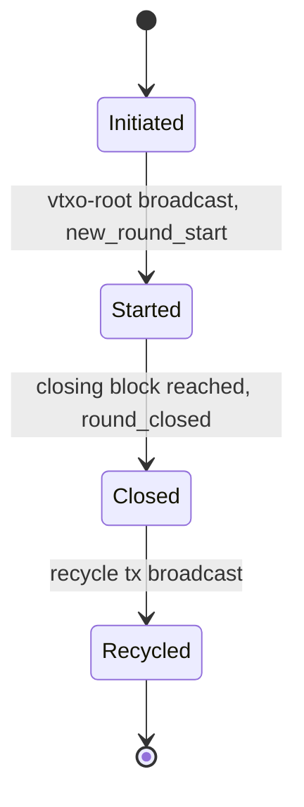
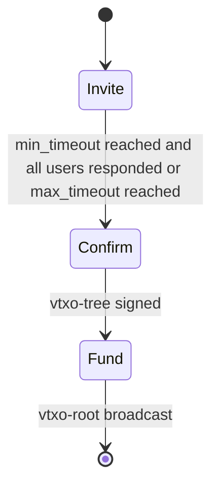
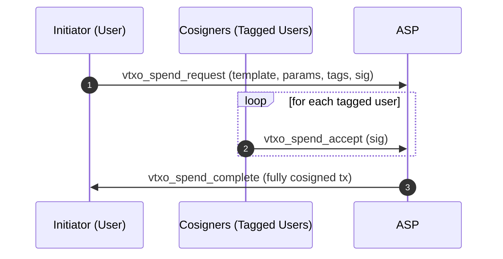
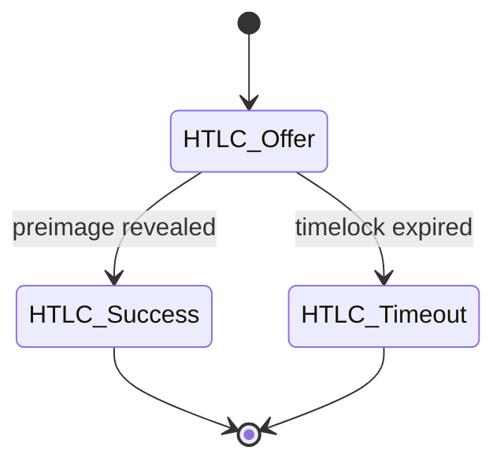
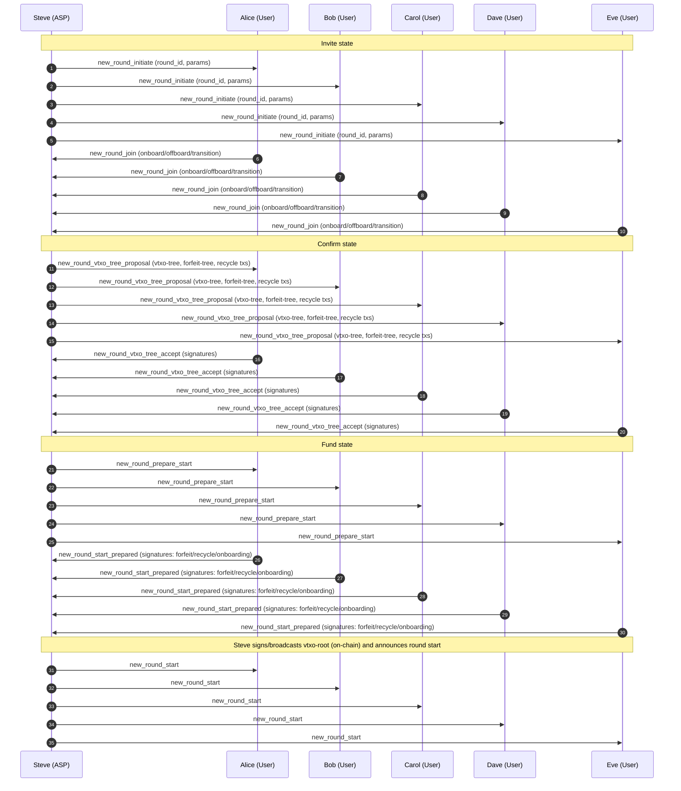
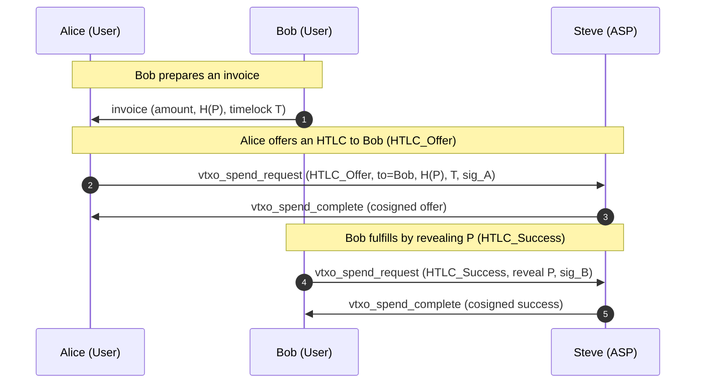
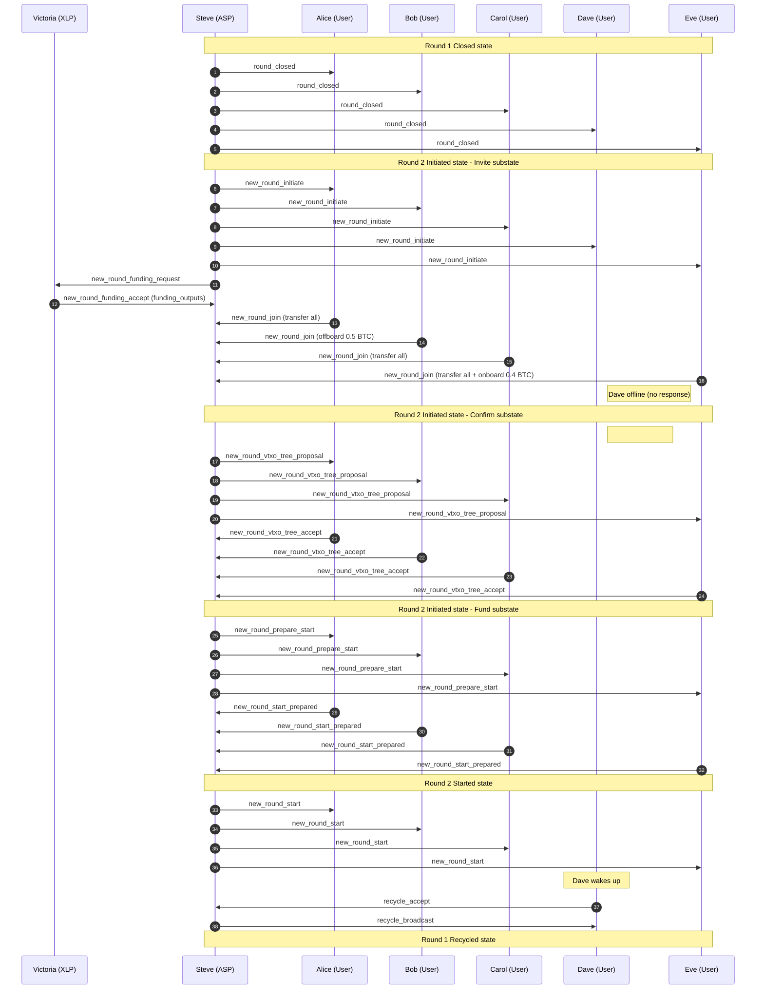

# OpenARK

## Status of this Document

This document specifies **BOLT-ARK**, a proposed extension to the Lightning Network protocol suite. It is an experimental specification intended for research, interoperability testing, and discussion. It does not modify existing BOLT consensus rules and introduces no new Bitcoin consensus changes.

The keywords **MUST**, **MUST NOT**, **SHOULD**, **SHOULD NOT**, and **MAY** are to be interpreted as described in RFC 2119.

---

## Abstract

OpenARK defines an extension to Lightning enabling **VTXO-based multi-party channels** with a designated **Ark Service Provider (ASP)** acting as a resolver and cosigner. The construction preserves HTLC semantics, supports RGB assets, and uses **Nostr** as the transport layer for off-chain coordination messages. The protocol allows many users to share a single on-chain root while retaining unilateral exit guarantees.

---

## Table of Contents

1. Introduction
2. Goals and Non-Goals
3. Terminology
4. System Model
5. Cryptographic Primitives
6. VTXO Model
7. Round Lifecycle
8. Message Transport (Nostr)
9. HTLC Semantics in ARK
10. Funding, Forfeit, and Recycle Transactions
11. On-chain Enforcement and Unilateral Exit
12. RGB Integration
13. Privacy Considerations
14. Security Considerations
15. Failure Modes and Recovery
16. Compatibility with Lightning (BOLT 2–11)
17. Deployment Considerations
18. Acknowledgements
19. Examples

---

## 1. Introduction

ARK extends Lightning by allowing multiple participants to share a **single on-chain funding root**, from which a **VTXO tree** is derived. State transitions are cosigned by an Ark Service Provider while preserving unilateral exit guarantees for users.

---

## 2. Goals and Non-Goals

### Goals
- Preserve HTLC compatibility with Lightning
- Enable many-user shared liquidity via VTXO trees
- Support RGB asset state transitions
- Use Nostr as a censorship-resistant transport
- Maintain unilateral exit at all times

### Non-Goals
- Removing Bitcoin enforcement
- Custodial fund control by the ASP

---

## 3. Terminology

- **ASP (Ark Service Provider)**:  
  Entity coordinating rounds and cosigning transitions.

- **User**:  
  Participant owning one or more VTXO series.

- **Co-Verifier**:  
  Optional third party holding one of the ASP threshold signing keys.

- **VTXO (Virtual Transaction Output)**:  
  A **finite, ordered series of off-chain transactions** that begins at a **vtxo-leaf**, traverses one or more
  **vtxo-branches**, reaches a **vtxo-trunk** as the first off-chain transaction, and is **anchored on-chain**
  by a **vtxo-root transaction**.

- **vtxo-leaf**:  
  The **final off-chain output** in a VTXO series. The vtxo-leaf represents the current spendable state and is the
  output that a user MAY unilaterally commit on-chain by broadcasting the required ancestor transaction path.
- **vtxo-branch**:  
  An **intermediate off-chain transaction** in a VTXO series that links a vtxo-leaf to the vtxo-trunk and
  encodes a valid state transition.

- **vtxo-trunk**:  
  The **first off-chain transaction** in a VTXO series, aggregating one or more vtxo-branches and serving as
  the off-chain predecessor to the vtxo-root transaction.

- **vtxo-root transaction**:  
  An **on-chain Bitcoin transaction** that anchors one or more vtxo-trunks and establishes on-chain
  enforceability of all descendant VTXO series.

- **Forfeit Transaction**:  
  A presigned off-chain transaction forming part of the **forfeit tree**. Forfeit transactions **atomically bind** a
  closed-round VTXO series to its successor state in a new round (or to the recycle path), ensuring that protocol rule
  violations result in loss of control **without granting the ASP unilateral spend authority**. The forfeit tree consists of:
  1. A **forfeit control transaction** that commits to the set of forfeitures for the round and defines when forfeiture becomes valid.
  2. One or more **forfeit leaf transactions**, each mapping a specific VTXO series (or cohort) to its successor commitment in the next round.

- **Recycle Transaction**:  
  An on-chain Bitcoin transaction that recovers value for inactive or offline users after the **recycle block height** has been reached.
  Two forms exist:
  - **Cooperative recycle transaction**: constructed for the round and intended to be signed by all participants; if fully signed, it MAY be broadcast before the recycle block.
  - **Unilateral recycle transaction**: presigned sufficiently for the ASP to broadcast after the recycle block; it MUST preserve each participant’s ability to reclaim their allocated output.
- **Round**:  
  A bounded time window in which VTXO transitions occur.

A VTXO **MUST** be interpreted strictly as an ordered path  
**vtxo-leaf → vtxo-branch(es) → vtxo-trunk → vtxo-root**  
and **MUST NOT** be interpreted as a single output, balance, or UTXO-like object.

## 4. System Model

The system consists of:
- Bitcoin L1 for final settlement
- Lightning-compatible HTLC semantics
- A Nostr relay network for coordination
- An ASP providing availability but not custody

Trust assumptions:
- ASP MAY censor but cannot steal funds
- Users MUST be able to exit unilaterally

---

## 5. Cryptographic Primitives

- Schnorr signatures (BIP-340)
- MuSig2 for aggregate signing
- Hashlocks and timelocks (BOLT-compatible)
- Threshold signatures for ASP + Co-Verifiers

---

## 6. VTXO Model

A VTXO is a finite, ordered series of off-chain transactions representing a claim to value under defined spending conditions. A user MAY unilaterally exit by broadcasting the vtxo-leaf together with the required ancestor transactions up to the on-chain vtxo-root transaction. A VTXO series consists of:

- Terminated by the final off-chain output in the series, called the **vtxo-leaf**.
- Bound via a set of presigned off-chain transactions, called **vtxo-branches**, linking the vtxo-leaf to the **vtxo-trunk**, and ultimately anchored in an on-chain **vtxo-root transaction**.
- Redeemable on-chain by broadcasting the series as specified above (unilateral exit).

Together, all VTXO series form a directed acyclic graph (the **vtxo-tree**).

---

## 7. Round Lifecycle

Each ARK round progresses through a well-defined set of states. Rounds are **time-bounded by Bitcoin block height** and advance deterministically based on protocol messages and on-chain conditions.

### 7.1 Round States

The lifecycle consists of the following states:

- **Initiated**
  The ASP announces a new round and accepts participant registrations.

- **Started**  
  The VTXO tree has been finalized, the round vtxo-root is anchored on-chain, and off-chain transitions may occur.

- **Closed**  
  The closing block has been reached. No new off-chain state transitions are permitted. Participants may prepare for exit or transfer funds to a new round.

- **Recycled**  
  The round is terminated. Remaining value is recovered via the recycle transaction, allowing inactive or offline participants to reclaim funds.

#### 7.1.1 Initiated state

This state has in turn three sub-states: invite, confirm, and fund.

##### Invite state
The goal of this substate is to invite users to join the round.

This substate starts with the ASP announces a new round using the `new_round_initiate` message, inviting users to join.

They do so by responding with a `new_round_join` message, containing:
- funds to onboard
- funds to offboard

The default is that all funds in the previous round are onboarded. If several users need to agree to on-board funds, perhaps because of  
a shared vtxo, then all users MUST agree to onboard for the vtxo to be included. 

The ASP then waits for either the min_timeout is reached and all users that are tagged have responded, or if the max_timeout is reached. 
Once this happens, the initialization is moved to the confirm substate. 

##### Confirm state
The goal of this substate is to finalize the vtxo-tree including the users signatures. 

This state starts with the ASP broadcasting the `new_round_vtxo_tree_proposal` message, containing:
- the new vtxo-tree
- forfeit tree
- unilateral recycle transaction
- cooperative recycle transaction

Users verify these transactions and return their signatures on the new vtxo-tree using the `new_round_vtxo_tree_accept` message.
Once all users have signed the new vtxo-tree, the initialization moves to the fund substate.

##### Fund state
The goal of this substate is to fund the round.

This state starts with the ASP broadcasting the `new_round_prepare_start` message. 

After which users respond with a `new_round_start_prepared` where they sign:
- the forfeit transactions
- the cooperative recycling transaction
- any onboarding transactions. 

When all of these are signed, the ASP will sign the vtxo-root and broadcast it, ending the initialization.

##### Aborting the initialization

A user can at any time and for any reason abort the onboarding and instead choose to have his capital recycled by issuing
a `new_round_abort` message. In this case, the initialization is aborted for that user, and their funds MUST be handled via the recycle path (or carried forward into the next round, if applicable).

#### 7.1.2 Started state
This state is entered when the VTXO tree has been finalized and the round vtxo-root is anchored on-chain and the ASP broadcasts the `new_round_start` message.

Here users can send and receive off-chain HTLCs.

#### 7.1.3 Closed state
This state is entered when the closing block has been found and the ASP broadcasts the `round_closed` message.

When the closing block is found, the ASP MUST immediately send a `vtxo_spend_aborted` on all outstanding `vtxo_spend_request` messages, then broadcasts the `round_closed` message, initiating the state.
Unless this round is the final round for the ASP and the service is terminating, a new round should be initiated using the procedure described in Section 7.1.1.

#### 7.1.4 Recycled state
This state is entered when the recycling transaction has been broadcast by the ASP.

Users that have not yet signed the recycle transaction can do this by broadcasting the `recycle_accept` message. Once all users have signed the recycle transaction, the ASP will broadcast the `recycle_broadcast` message, initiating the state.
This can either happen when all users, as well as the ASP have signed and broadcast the recycle transaction (collaborative recycling) or when the recycling block has been found unilaterally (unilateral recycling).

### 7.2 Block Height Bounds

Two block-height parameters define round progression:

- **Closing Block**  
  The Bitcoin block height at which the round MUST transition from *Started* to *Closed*. After this point, no new off-chain transitions are allowed.

- **Recycle Block**  
  The Bitcoin block height at which the ASP MAY unilaterally sign and broadcast the recycle transaction, transitioning the round to *Recycled*.

These bounds guarantee liveness while preserving unilateral exit guarantees for all users.

### 7.3 HTLC Transitions

Like Lightning, OpenARK supports HTLC transactions to make OpenARK compatible with existing Lightning Network. Unlike Lightning, the procedure is much simpler to implement.
In OpenARK we only need a few simple transactions to create a HTLC state machine. These are based around the following pattern,

1. A user initiates a `vtxo_spend_request` message, including:
   1. tagging the template in use.
   2. parameters required by the model.
   3. tagging any other users that need to co-sign the request.
   4. signature
2. Other users that are tagged in the request will issue a `vtxo_spend_accept` message, providing their signature.
3. Once all users have signed the request, the ASP will issue a `vtxo_spend_complete` message, providing the complete transaction.

#### Aborting a Request

A `vtxo_spend_request` can be aborted in four ways:

1. If a tagged user rejects the request, he can issue a `vtxo_spend_reject` message, optionally providing a reason for the rejection. 
2. The user that initiated the request can issue a `vtxo_spend_abort_request`.
3. The closing block is reached.
4. the ASP rejects the request for any reason.

In either case the ASP MUST issue a `vtxo_spend_failed` message, making the vtxo free again.

## 8. HTLC Semantics in ARK

ARK preserves Lightning HTLC semantics:

HTLCs MAY be resolved:
- Off-chain via ASP cosignature
- On-chain via unilateral exit

#### HTLC States

##### HTLC_Offer

This state locks the vtxo-leaf of a VTXO series with a lock base around `B + H(P) + ( dT1 | S ) | A + ( T | B ) + ( dt2 | S )` where:

1. A is the sending key.
2. B is the receiving key.
3. H(P) is the preimage hash.
4. S is the ASP.
5. T is the HTLC timelock.
6. dt1 is the success ark-timeout.
7. dt2 is the timeout ark-timeout.

It is signed by A, S.

##### HTLC_Success

This state transfers a HTLC vtxo into a simple `B+S | B + dT` where:

1. B is the receiving key.
2. dT is the ark-timelock.

It is signed by B, P, S.
Here S verifies that B has signed the transaction and that the preimage matches H(P).

##### HTLC_Timeout

This state transfers a HTLC vtxo into a simple `A+S | A + dT` where:

1. A is the sending key.
2. dT is the ark-timelock.

It is signed by A, S, and optionally B.
Here S verifies that either B has signed the transaction, or T has passed.

## 9. Message Transport (Nostr)

ARK messages are transported over Nostr events.

Requirements:
- Messages MUST be signed by the sender
- Events MUST reference the round ID
- Relays MUST be treated as untrusted

This document defers detailed encoding to a companion **NIP-150** specification.

---

## Two-tier security – Cloud Agents

OpenARK MAY be used with an always-on agent to represent a user in the ARK. This does not diverge from traditional 
lightning setups, where the user in practice is required to run an always-on guard tower, that prevents the counterparty from 
broadcasting an old state. Now in ARK the responsibility is extended beyond just guarding for fraudulent unilateral exits to also
include managing the round transition. The protocol is therefore designed with this in mind. When we describe the transactions above 
we usually refer to a single large letter, say A to represent the user. Now in practice this is a shortcut. The large A represent a 
valid signature from the user A. But in practice it is more complicated. When a user first joins the ARK, he will present two Nostr ids,
one primary id, used by the owner, and one secondary id used by the agent. He will also present two distinct key series, one used by the owner, A',
and one used by the agent, A''. The letter A is then represented by a combination of signatures. A' | A'' in the vtxo-tree root, trunk, and branches,
and A' | A'' + T for the leaves, where T is the closing block of the round.

From this setup the user can tailor his setup to meet his security needs. Some users may prefer to run an always-on cloud wallet that combines the 
responsibilities of a guard tower and the wallet, renting a spot in the datacenter for their own hardware, possibly with an HSM module.

Other users may outsource the agent role and limit it to simply guard against fraudulent unilateral exits and help with the round transition.
In this case it might make sense to limit the agents' access to only include the A'' series of keys and do a rekey at the start of each round.

## 10. Funding, Forfeit, and Recycle Transactions

### Funding
Users MAY fund rounds by:
- Transferring value from a previous round
- Adding new on-chain inputs

### Forfeit Transactions
Forfeit transactions atomically bind the transfer of ownership from the User to the ASP in a closed-round vtxo to a new-round vtxo-root. Making the root deposit an atomic transaction, enacting the forfeiture.   

### Recycle Transactions
Recycle transactions recover value to offline or inactive participants, enabling early termination of a round.

---

## 11. On-chain Enforcement and Unilateral Exit

At any time, a user MAY:
- Broadcast a unilateral exit transaction
- Claim their VTXO value on-chain by converting the VTXO to a UTXO.

All VTXOs MUST map to a valid on-chain spending path.

---

### External Liquidity Providers

In the case where the ASP does not have enough funds to cover the cost of the round, one or several external liquidity 
providers (XLPs) MAY be used to raise the required capital. In this case the XLP SHOULD join the ASP as a co-verifier. 
They serve a dual role, they provide trust by increasing the number of verifiers for the critical S key. They also provide
liquidity in the round. 

This is done by the ASP adding the XLPs on-chain inputs to fund the vtxo-root, but then in turn adding matching XLPs outputs 
to the forfeit as well as the recycle transactions. The procedure is transparent, and the XLP can verify that if the vtxo-root
is deposited, then he can regain his funds either through the forfeit transactions or preferably by recycle transaction, at
the latest when the recycle block is discovered.

To achieve this, the ASP SHOULD request a list of available utxos from the XLPs, using the `new_round_funding_request` message.
The XLPs SHOULD return a list of utxos that are suitable for funding the round in the `new_round_funding_accept` message.

## 12. RGB Integration

ARK supports RGB by associating asset state transitions with VTXO transitions.

Requirements:
- RGB state MUST follow Bitcoin ownership
- Asset and BTC transitions MUST be atomic

Examples in Section 2 illustrate cross-asset HTLC swaps.

---

## 13. Privacy Considerations

- VTXO ownership is off-chain
- ASP learns graph structure but not intent
- Nostr metadata leakage MUST be considered

Additional considerations:
- Nostr relay selection and event timing MAY leak sender/receiver correlation.
- Implementations SHOULD randomize relay sets and consider padding/delays where feasible.
- Public rounds (if any) SHOULD minimize announcement metadata beyond what is required for coordination.
---

## 14. Security Considerations

Threats:
- ASP censorship
- Relay censorship
- Key compromise

Mitigations:
- Unilateral exits
- Time-bounded rounds
- Threshold signing

Additional threats and mitigations:
- **Equivocation by ASP**: mitigated by requiring participant verification of the vtxo-tree, forfeit tree, and recycle transactions before signing.
- **Key compromise (user/agent)**: mitigated by key separation (A' vs A'') and per-round rekeying; implementations SHOULD support rapid revocation and rekey.
- **Relay eclipse / partition**: mitigated by multi-relay publication and out-of-band peer connectivity where available.
---

## 15. Failure Modes and Recovery

- Offline users are handled via recycle paths
- ASP failure triggers unilateral exits
- Co-Verifiers reduce single-operator risk

---

## 16. Compatibility with Lightning (BOLT 2–11)

ARK:
- Preserves HTLC behavior
- Does not alter gossip or routing
- Operates as an L2/L3 construction

Existing Lightning nodes are not required to understand ARK internals.

Compatibility notes:
- ARK HTLC templates MUST implement the same hashlock/timelock safety properties as BOLT HTLCs.
- The protocol is compatible with existing invoices and payment flows when the sender/receiver endpoints can construct ARK HTLC templates.
- ARK does not require changes to Bitcoin consensus rules or to the BOLT transport framing; it layers above existing Lightning semantics.

---

## 17. Deployment Considerations

- ASPs SHOULD publish reliability metrics
- Users SHOULD limit exposure per round
- Multiple ASPs MAY coexist interconnected via lightning.

Additional operational guidance:
- ASP operators SHOULD publish round parameters (min/max timeouts, closing/recycle blocks) in a discoverable way.
- Users SHOULD enforce per-round exposure limits and SHOULD prefer diversified ASPs for large balances.
- Implementations SHOULD surface clear UX around transition risk at the closing block and at the recycle block.

---

## 18. Acknowledgements

This design draws inspiration from Lightning, channel factories, and the ARK research lineage.

## 19. Examples

### Roles

- **Short roles**: A=Alice, B=Bob, C=Carol, D=Dave, E=Eve, S=Steve (ASP), V=Victoria (XLP)

- **Users**: Alice, Bob, Carol, Dave, Eve.
- **Ark Service Provider (ASP)**: Steve.
- **External Liquidity Provider (XLP)**: Victoria.

### Example 1.0 – Alice, Bob, Carol, Dave, and Eve create a VTXO tree

In this part of the example, the users join a new ARK round run by Steve.

1. Steve issues a `new_round_initiate`
    1. Informs everybody that a new round is starting.
2. Alice, Bob, Carol, Dave, and Eve reply with `new_round_join`
    1. Here the Users declare what to onboard, what to offboard, and what to transition.

3. Steve issues a `new_round_vtxo_tree_proposal`
    1. Here Steve sends out the VTXO tree for signing.
4. Alice, Bob, Carol, Dave, and Eve issue a `new_round_vtxo_tree_accept`
    1. Here the Users return the signed nodes.

5. Steve issues a `new_round_prepare_start`
    1. Here Steve sends out the new root for signature, binding the tree to the root.
6. Alice, Bob, Carol, Dave, and Eve issue a `new_round_start_prepared`.
    1. Here all Users accept the tree.

7. Steve issues a `new_round_start`.
    1. The root is deposited and the round starts. This is the official start of the round.

### Example 1.1 – Alice pays Bob

This example uses the `vtxo_spend_*` flow described in Section 7.3 and the HTLC states described in Section 8.

1. **Invoice creation**
   1. Bob samples a secret preimage **P** and computes **H(P)**.
   2. Bob sends Alice an invoice containing the amount, **H(P)**, and timelock **T**.

2. **Offer (HTLC_Offer)**
   1. Alice constructs a `vtxo_spend_request`, tagged as `HTLC_Offer`, that locks funds under hashlock **H(P)** and timelock **T**.
   2. Steve verifies required signatures and issues `vtxo_spend_complete`, finalizing the offer state.

3. **Fulfill (HTLC_Success)**
   1. Bob reveals **P** by constructing a `vtxo_spend_request`, tagged as `HTLC_Success`.
   2. Steve verifies `H(P)`, signatures and issues `vtxo_spend_complete`, finalizing the success state.

If Bob does not fulfill before **T**, Alice MAY instead progress to `HTLC_Timeout` using an analogous `vtxo_spend_request` flow.

### Example 1.2 – Round ends, Bob offboards 0.5 BTC, Dave is offline, Eve onboards 0.4 BTC

This example illustrates round closure, offboarding, onboarding, and recycling behavior when a participant is offline.

1. The Bitcoin block designated as the **closing block** is mined.
2. Steve broadcasts `round_closed`, marking the end of off-chain activity for the round.
3. Steve initiates a new round with `new_round_initiate`.
4. In parallel he asks Victoria to provide funding for the round using `new_round_funding_request`.
5. Victoria responds with `new_round_funding_accept` containing the outputs that can be used to fund the round.
6. Participants respond with `new_round_join`:
   1. Alice transfers all capital forward.
   2. Bob offboards **0.5 BTC**.
   3. Carol transfers all capital forward.
   4. Dave is offline and does not respond.
   5. Eve transfers all existing capital and onboards **0.4 BTC**.
7. After the timeout, Steve issues `new_round_vtxo_tree_proposal`, including:
   1. A new round transaction containing:
       1. A new VTXO root output, locked with A+B+C+E+S | S + T=400.
       2. An offboarding output for Bob
       3. A forfeit root output.
       4. A funding input for Eve.
       5. A funding input for Steve.
   2. Forfeit control transaction.
   3. Forfeit transactions for the capital that is being transferred.
   4. A recycle transaction for the round containing:
       1. An output with Dave's capital based on his recycle address.
       2. An output to Steve with the rest of the capital.
8. Alice, Bob, Carol, and Eve verify the proposal and respond with `new_round_vtxo_tree_accept`.
9. Steve requests final signatures via `new_round_prepare_start`.
10. Alice, Bob, Carol, and Eve respond with `new_round_start_prepared`.
    - it contains signatures for the forfeit, funding, and cooperative recycle transactions. 
11. Steve broadcasts the new round root and issues `new_round_start`.
12. When Dave later comes online, he issues `recycle_accept`.
    - it contains signatures for the cooperative recycle transaction.
13. Steve broadcasts the cooperative recycle transaction, allowing Dave to recover his funds.

Example 1.3 David uses Victorias lightning service to receive a payment from Xavier that has an external channel to Victoria.

Prerequisites: 
- Victoria is has collected a hashmap mapping scid_alias to pubkey, and nostrid of the users in the ARK. 

1. David creates a QR code containing the invoice for 0.1 BTC.
    - it contains the following:
      1. The invoice amount. (0.1 BTC)
      2. The invoice payment hash.
      3. The payment secret.
      4. routing hints, containing:
         1. Victorias node id.
         2. Davids scid_alias.
         3. fee_base_msat.
         4. fee_proportional_millionths.
         5. cltv_expiry_delta.
      5. The signature of the invoice, containing Daves node pubkey.

2. Xavier scans the QR code and sends the payment
   - from this he creates a HTLC including an onion payload.
     - the onion payload contains two layers, first Victoria's, and then Davids.
3. Xavier sends the HTLC to Victoria, using `update_add_htlc`.
   - The HTLC contains the following values:
     - 
4. Victoria recives the HTLC it cointains.
   - H(P)
   - Timeouts
   - Value
   - The onion layer contains:
     - Daves scid_alias. 
     - Daves onion layer.

5. Xavier sends `commitment_signed`
6. Victoria answers with `revoke_and_ack`
7. Victoria sends `commitment_signed`
8. Xavier answers with `revoke_and_ack`

9. Victoria looks up Daves scid and sees that it is pointing to an in ARK user.

10. Victoria creates a `vtxo_spend_request` tagged as `HTLC_Offer`, it is:
    - tagged with Daves pubkey.
    - contains Daves onion layer.
    - locked with H(P) 
    - Timeouts

11. Steve verifies required signatures and issues `vtxo_spend_complete`.

12. Daves sees that he as received a `HTLC_Offer`, he decodes the onion layer and verifies the signature.
    - It cointains the following values:
      - payment secret.

13. David accepts the payment, creates a `vtxo_spend_request` tagged as `HTLC_Success`.
    - It contains the following values:
    - H(P)

14. Steve verifies `H(P)`, and issues `vtxo_spend_complete`.

15. Victoria sees that David has accepted the HTLC, she uses the info to send `update_fulfill_htlc` to Xavier. 
16. Victoria sends  `commitment_signed`
17. Xavier answers with `revoke_and_ack`
18. Xavier sends  `commitment_signed` 
19. Victoria answers with `revoke_and_ack`
