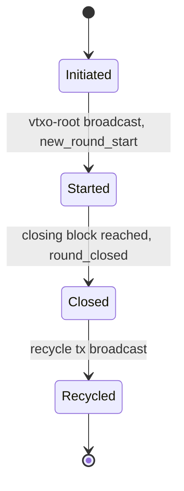
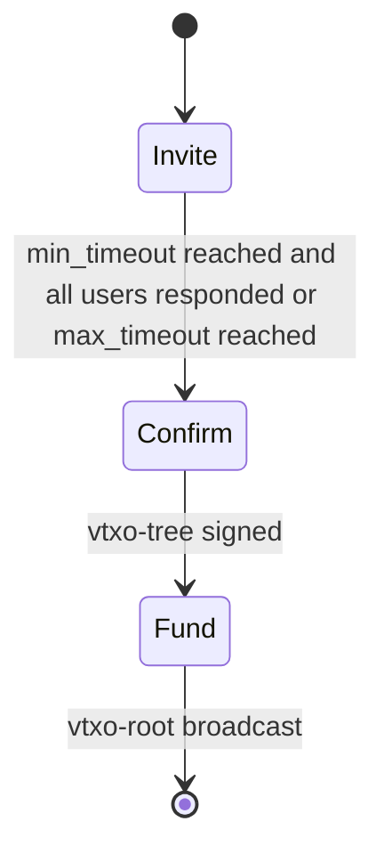
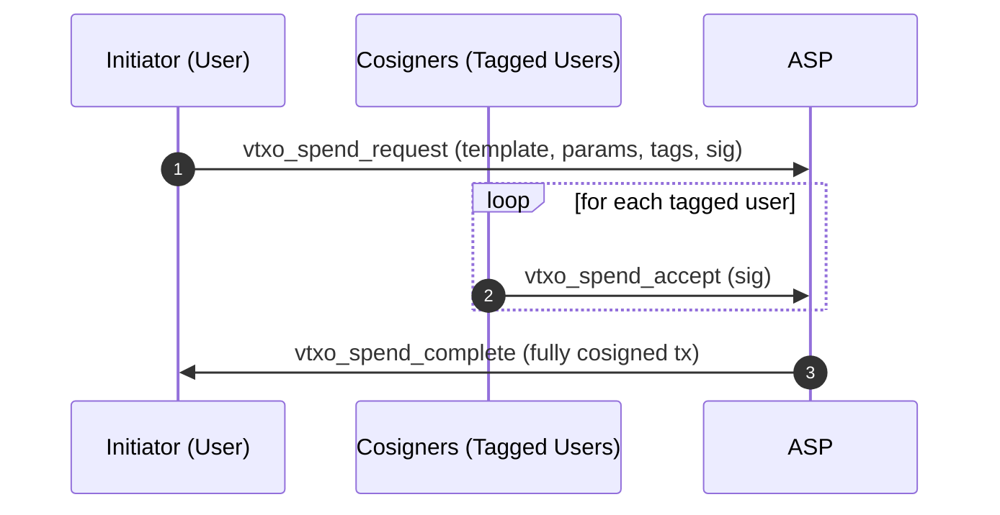
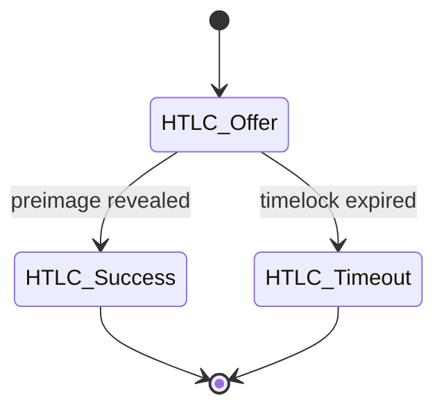
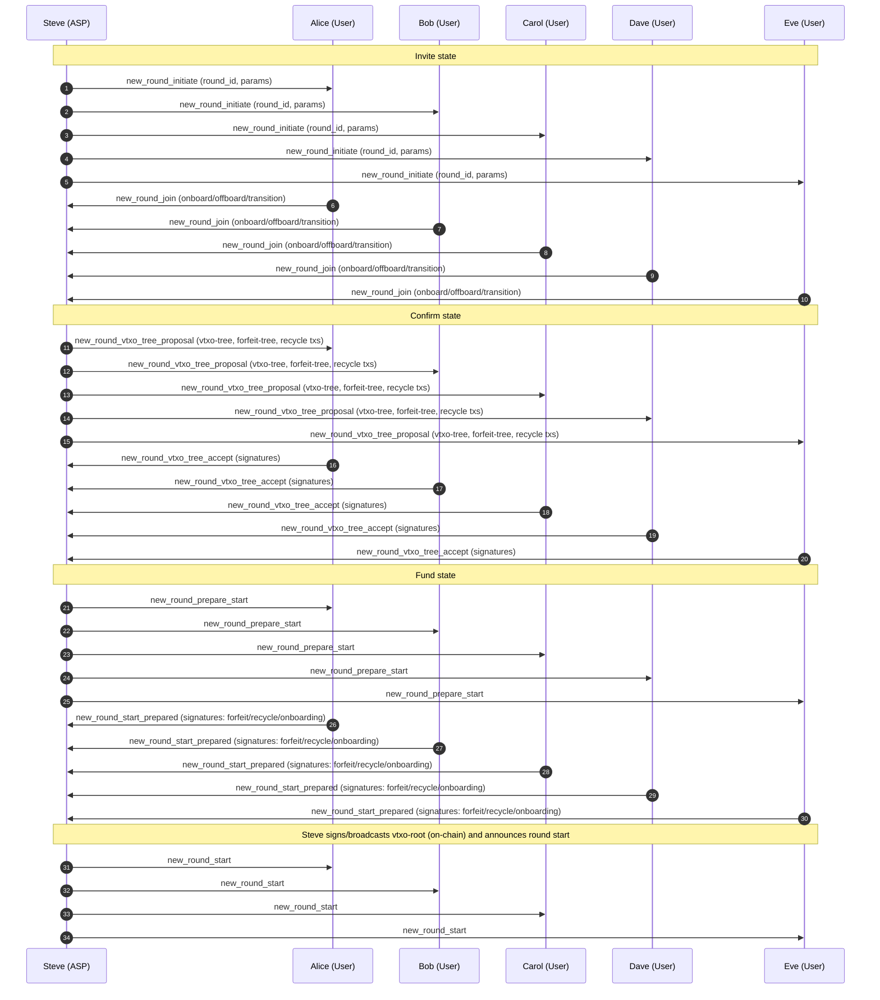
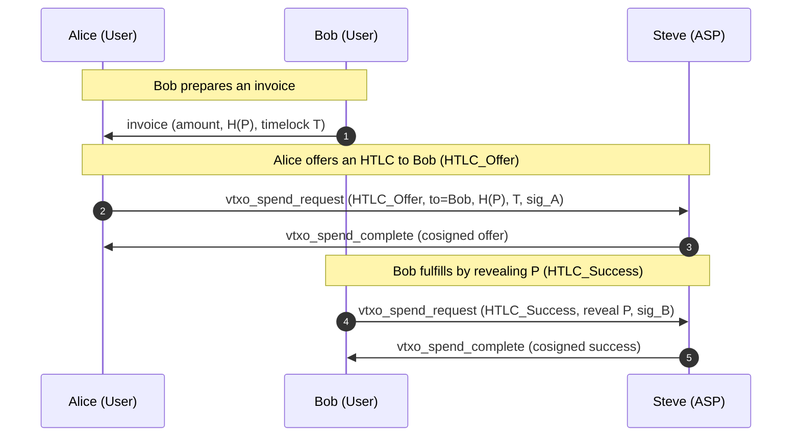
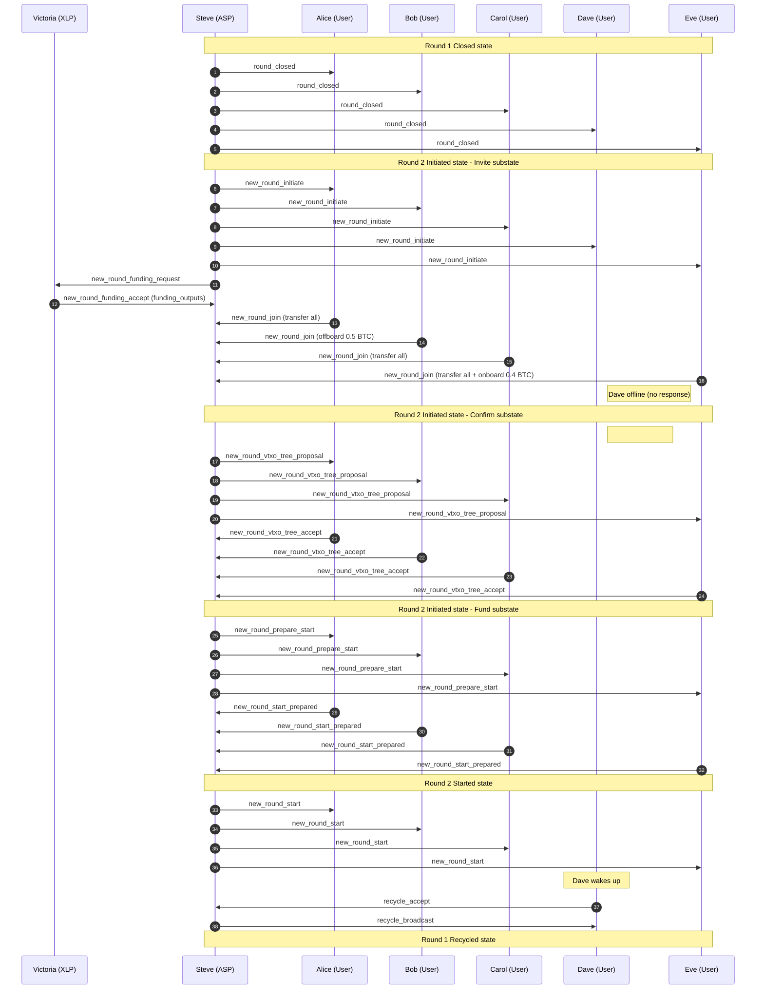
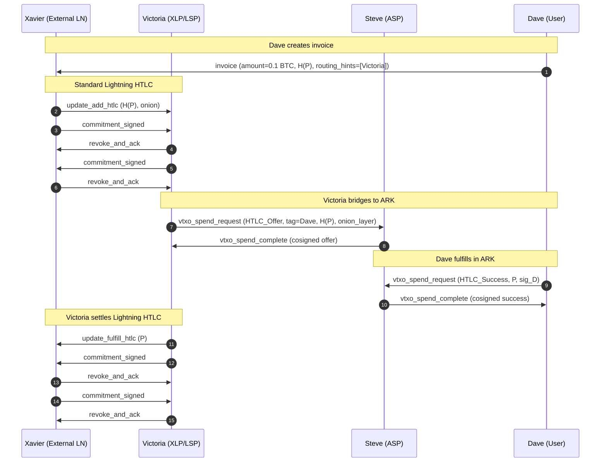
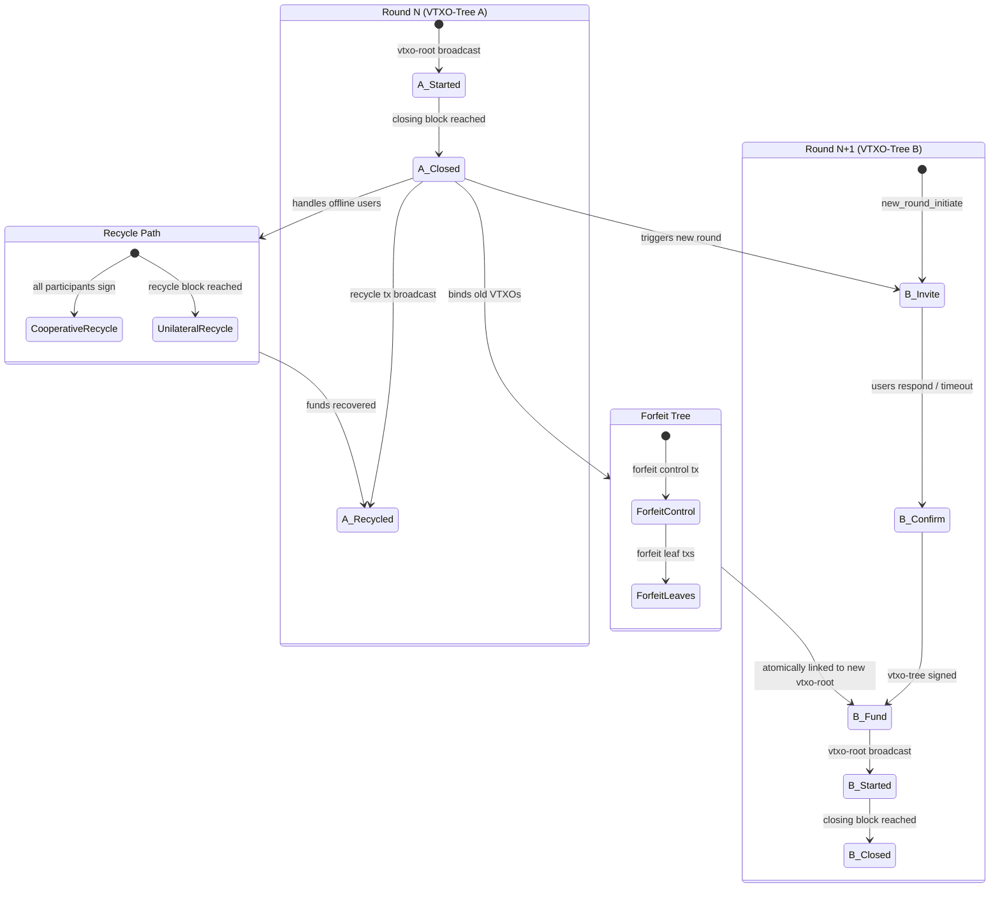

# OpenARK

## Status of this Document

This document specifies **BOLT-ARK**, a proposed extension to the Lightning Network protocol suite. It is an experimental specification intended for research, interoperability testing, and discussion. It does not modify existing BOLT consensus rules and introduces no new Bitcoin consensus changes.

The keywords **MUST**, **MUST NOT**, **SHOULD**, **SHOULD NOT**, and **MAY** are to be interpreted as described in RFC 2119.

---

## Abstract

OpenARK defines an extension to Lightning enabling **VTXO-based multi-party channels** with a designated **Ark Service Provider (ASP)** acting as a resolver and cosigner. The construction preserves HTLC semantics, supports RGB assets, and uses **Nostr** as the transport layer for off-chain coordination messages. The protocol allows many users to share a single on-chain root while retaining unilateral exit guarantees.

---

## Table of Contents

1. Introduction
2. Goals and Non-Goals
3. Terminology
4. System Model
5. Cryptographic Primitives
6. Script Notation
7. VTXO Model
8. VTXO Tree Construction
9. Round Lifecycle
10. Message Transport (Nostr)
11. Message Catalog
12. HTLC Semantics in ARK
13. Funding, Forfeit, and Recycle Transactions
14. On-chain Enforcement and Unilateral Exit
15. Two-Tier Security: Cloud Agents
16. External Liquidity Providers
17. Fee Model
18. RGB Integration
19. Privacy Considerations
20. Security Considerations
21. Failure Modes and Recovery
22. Compatibility with Lightning (BOLT 2–11)
23. Deployment Considerations
24. Parameter Recommendations
25. Acknowledgements
26. Examples

---

## 1. Introduction

ARK extends Lightning by allowing multiple participants to share a **single on-chain funding root**, from which a **VTXO tree** is derived. State transitions are cosigned by an Ark Service Provider while preserving unilateral exit guarantees for users.

---

## 2. Goals and Non-Goals

### Goals
- Preserve HTLC compatibility with Lightning
- Enable many-user shared liquidity via VTXO trees
- Support RGB asset state transitions
- Use Nostr as a censorship-resistant transport
- Maintain unilateral exit at all times

### Non-Goals
- Removing Bitcoin enforcement
- Custodial fund control by the ASP

---

## 3. Terminology

- **ASP (Ark Service Provider)**:  
  Entity coordinating rounds and cosigning transitions.

- **User**:  
  Participant owning one or more VTXO series.

- **Co-Verifier**:  
  Optional third party holding one of the ASP threshold signing keys.

- **VTXO (Virtual Transaction Output)**:  
  A **finite, ordered series of off-chain transactions** that begins at a **vtxo-leaf**, traverses one or more
  **vtxo-branches**, reaches a **vtxo-trunk** as the first off-chain transaction, and is **anchored on-chain**
  by a **vtxo-root transaction**.

- **vtxo-leaf**:  
  The **final off-chain output** in a VTXO series. The vtxo-leaf represents the current spendable state and is the
  output that a user MAY unilaterally commit on-chain by broadcasting the required ancestor transaction path.

- **vtxo-branch**:  
  An **intermediate off-chain transaction** in a VTXO series that links a vtxo-leaf to the vtxo-trunk and
  encodes a valid state transition.

- **vtxo-trunk**:  
  The **first off-chain transaction** in a VTXO series, aggregating one or more vtxo-branches and serving as
  the off-chain predecessor to the vtxo-root transaction.

- **vtxo-root transaction**:  
  An **on-chain Bitcoin transaction** that anchors one or more vtxo-trunks and establishes on-chain
  enforceability of all descendant VTXO series.

- **Forfeit Transaction**:  
  A presigned off-chain transaction forming part of the **forfeit tree**. Forfeit transactions **atomically bind** a
  closed-round VTXO series to its successor state in a new round (or to the recycle path), ensuring that protocol rule
  violations result in loss of control **without granting the ASP unilateral spend authority**. The forfeit tree consists of:
  1. A **forfeit control transaction** that commits to the set of forfeitures for the round and defines when forfeiture becomes valid.
  2. One or more **forfeit leaf transactions**, each mapping a specific VTXO series (or cohort) to its successor commitment in the next round.
  
  Atomicity is enforced by including the **forfeit root as an output of the new vtxo-root transaction**. Broadcasting the new vtxo-root simultaneously activates the forfeit tree, ensuring that old-round VTXOs are bound to the new round in a single on-chain event.

- **Recycle Transaction**:  
  An on-chain Bitcoin transaction that recovers value for inactive or offline users after the **recycle block height** has been reached.
  Two forms exist:
  - **Cooperative recycle transaction**: constructed for the round and intended to be signed by all participants; if fully signed, it MAY be broadcast before the recycle block.
  - **Unilateral recycle transaction**: presigned sufficiently for the ASP to broadcast after the recycle block. The unilateral recycle transaction MUST include a script-level timelock (e.g., `OP_CHECKLOCKTIMEVERIFY`) enforcing the recycle block height, preventing early broadcast. It MUST preserve each participant's ability to reclaim their allocated output.

- **Round**:  
  A bounded time window in which VTXO transitions occur.

- **XLP (External Liquidity Provider)**:  
  An entity providing on-chain capital to fund a round without operating the ASP itself. See Section 16.

A VTXO **MUST** be interpreted strictly as an ordered path  
**vtxo-leaf → vtxo-branch(es) → vtxo-trunk → vtxo-root**  
and **MUST NOT** be interpreted as a single output, balance, or UTXO-like object.

## 4. System Model

The system consists of:
- Bitcoin L1 for final settlement
- Lightning-compatible HTLC semantics
- A Nostr relay network for coordination
- An ASP providing availability but not custody

Trust assumptions:
- ASP MAY censor but cannot steal funds
- Users MUST be able to exit unilaterally
- The ASP timeout path on the vtxo-root (see Section 13) leads to the recycle transaction, which MUST preserve per-user outputs. The ASP does NOT gain unilateral spend authority after the timeout.

---

## 5. Cryptographic Primitives

- Schnorr signatures (BIP-340)
- MuSig2 for aggregate signing
- Hashlocks and timelocks (BOLT-compatible)
- Threshold signatures for ASP + Co-Verifiers

---

## 6. Script Notation

This specification uses a compact notation for Bitcoin spending conditions. The following operators are defined:

| Operator | Meaning | Example |
|----------|---------|---------|
| `AND` | Both conditions required | `A AND B` — signatures from both A and B |
| `OR` | Either condition sufficient | `A OR B` — signature from A or B |
| `H(P)` | Hashlock | Preimage P must be revealed such that `SHA256(P) = H(P)` |
| `AFTER(T)` | Absolute timelock | Valid only after block height T (`OP_CHECKLOCKTIMEVERIFY`) |
| `DELAY(dT)` | Relative timelock | Valid only after dT blocks from confirmation (`OP_CHECKSEQUENCEVERIFY`) |

Parentheses group sub-expressions. Top-level alternatives are separated by `OR`.

**Example**: `(A AND B) OR (A AND AFTER(T))` means: either A and B sign cooperatively, or A signs after block height T.

All keys (A, B, S, etc.) refer to Schnorr public keys (BIP-340). Where a key represents an aggregate (e.g., MuSig2 of owner and agent), this is noted explicitly.

---

## 7. VTXO Model

A VTXO is a finite, ordered series of off-chain transactions representing a claim to value under defined spending conditions. A user MAY unilaterally exit by broadcasting the vtxo-leaf together with the required ancestor transactions up to the on-chain vtxo-root transaction. A VTXO series consists of:

- Terminated by the final off-chain output in the series, called the **vtxo-leaf**.
- Bound via a set of presigned off-chain transactions, called **vtxo-branches**, linking the vtxo-leaf to the **vtxo-trunk**, and ultimately anchored in an on-chain **vtxo-root transaction**.
- Redeemable on-chain by broadcasting the series as specified above (unilateral exit).

Together, all VTXO series form a directed acyclic graph (the **vtxo-tree**).

---

## 8. VTXO Tree Construction

The ASP constructs the VTXO tree as a **balanced binary tree** of presigned transactions. The tree topology determines the worst-case unilateral exit cost: a user must broadcast all transactions along the path from their vtxo-leaf to the vtxo-root.

### 8.1 Tree Structure

For N users, the ASP SHOULD construct a binary tree of depth ⌈log₂(N)⌉. Each internal node is a vtxo-branch transaction whose outputs fund two child branches (or leaves). The vtxo-trunk aggregates the top-level branches and is spent by the vtxo-root transaction.

### 8.2 Unilateral Exit Cost

A user performing a unilateral exit MUST broadcast:
- The vtxo-root transaction (already on-chain).
- Each vtxo-branch along the path from root to their leaf.
- Their vtxo-leaf transaction.

For a tree of depth D, this requires broadcasting D+1 transactions. Implementations SHOULD target a maximum tree depth of 10 (supporting up to 1024 users per round) to bound worst-case exit cost.

### 8.3 Topology Constraints

- The ASP MUST NOT construct degenerate trees (e.g., linear chains) that inflate exit cost for specific users.
- Users SHOULD verify that their path depth does not exceed the announced maximum depth before signing the vtxo-tree.

---

## 9. Round Lifecycle

Each ARK round progresses through a well-defined set of states. Rounds are **time-bounded by Bitcoin block height** and advance deterministically based on protocol messages and on-chain conditions.

### 9.1 Round States

The lifecycle consists of the following states:

- **Initiated**
  The ASP announces a new round and accepts participant registrations.

- **Started**  
  The VTXO tree has been finalized, the round vtxo-root is anchored on-chain, and off-chain transitions may occur.

- **Closed**  
  The closing block has been reached. No new off-chain state transitions are permitted. Participants may prepare for exit or transfer funds to a new round.

- **Recycled**  
  The round is terminated. Remaining value is recovered via the recycle transaction, allowing inactive or offline participants to reclaim funds.

#### 9.1.1 Initiated state

This state has in turn three sub-states: invite, confirm, and fund.

##### Invite state
The goal of this substate is to invite users to join the round.

This substate starts with the ASP announcing a new round using the `new_round_initiate` message, inviting users to join.

They do so by responding with a `new_round_join` message, containing:
- funds to onboard
- funds to offboard

The default is that all funds in the previous round are onboarded. If several users need to agree to onboard funds, perhaps because of  
a shared vtxo, then all users MUST agree to onboard for the vtxo to be included. 

The ASP then waits for either the min_timeout is reached and all users that are tagged have responded, or if the max_timeout is reached. 
Once this happens, the initialization is moved to the confirm substate. 

##### Confirm state
The goal of this substate is to finalize the vtxo-tree including the users signatures. 

This state starts with the ASP broadcasting the `new_round_vtxo_tree_proposal` message, containing:
- the new vtxo-tree
- forfeit tree
- unilateral recycle transaction
- cooperative recycle transaction

Users verify these transactions and return their signatures on the new vtxo-tree using the `new_round_vtxo_tree_accept` message.
Once all users have signed the new vtxo-tree, the initialization moves to the fund substate.

##### Fund state
The goal of this substate is to fund the round.

This state starts with the ASP broadcasting the `new_round_prepare_start` message. 

After which users respond with a `new_round_start_prepared` where they sign:
- the forfeit transactions
- the cooperative recycling transaction
- any onboarding transactions. 

When all of these are signed, the ASP will sign the vtxo-root and broadcast it, ending the initialization.

##### Aborting the initialization

A user can at any time and for any reason abort the onboarding and instead choose to have his capital recycled by issuing
a `new_round_abort` message. In this case, the initialization is aborted for that user, and their funds MUST be handled via the recycle path (or carried forward into the next round, if applicable).

#### 9.1.2 Started state
This state is entered when the VTXO tree has been finalized and the round vtxo-root is anchored on-chain and the ASP broadcasts the `new_round_start` message.

Here users can send and receive off-chain HTLCs.

#### 9.1.3 Closed state
This state is entered when the closing block has been found and the ASP broadcasts the `round_closed` message.

When the closing block is found, the ASP MUST immediately send a `vtxo_spend_aborted` on all outstanding `vtxo_spend_request` messages, then broadcasts the `round_closed` message, initiating the state.
Unless this round is the final round for the ASP and the service is terminating, a new round SHOULD be initiated using the procedure described in Section 9.1.1.

#### 9.1.4 Recycled state
This state is entered when the recycling transaction has been broadcast by the ASP.

Users that have not yet signed the recycle transaction can do this by broadcasting the `recycle_accept` message. Once all users have signed the recycle transaction, the ASP will broadcast the `recycle_broadcast` message, initiating the state.
This can either happen when all users, as well as the ASP have signed and broadcast the recycle transaction (collaborative recycling) or when the recycling block has been found unilaterally (unilateral recycling).

### 9.2 Block Height Bounds

Two block-height parameters define round progression:

- **Closing Block**  
  The Bitcoin block height at which the round MUST transition from *Started* to *Closed*. After this point, no new off-chain transitions are allowed.

- **Recycle Block**  
  The Bitcoin block height at which the ASP MAY unilaterally sign and broadcast the recycle transaction, transitioning the round to *Recycled*. The recycle block MUST be at least `RECYCLE_DELTA` blocks after the closing block (see Section 24).

These bounds guarantee liveness while preserving unilateral exit guarantees for all users.

### 9.3 VTXO Spend Flow

OpenARK uses a generic `vtxo_spend_request` pattern for all off-chain state transitions, including HTLC operations. This pattern is:

1. A user initiates a `vtxo_spend_request` message, including:
   1. tagging the template in use.
   2. parameters required by the model.
   3. tagging any other users that need to co-sign the request.
   4. signature
2. Other users that are tagged in the request will issue a `vtxo_spend_accept` message, providing their signature.
3. Once all users have signed the request, the ASP will issue a `vtxo_spend_complete` message, providing the complete transaction.

#### Aborting a Request

A `vtxo_spend_request` can be aborted in four ways:

1. If a tagged user rejects the request, they can issue a `vtxo_spend_reject` message, optionally providing a reason for the rejection. 
2. The user that initiated the request can issue a `vtxo_spend_abort_request`.
3. The closing block is reached.
4. The ASP rejects the request for any reason.

In all cases the ASP MUST issue a `vtxo_spend_aborted` message, making the vtxo free again.

---

## 10. Message Transport (Nostr)

ARK messages are transported over Nostr events.

Requirements:
- Messages MUST be signed by the sender
- Events MUST reference the round ID
- Relays MUST be treated as untrusted

This document defers detailed encoding to a companion **NIP-150** specification.

---

## 11. Message Catalog

The following table enumerates all protocol messages. Detailed field definitions and encoding are specified in the companion NIP-150 document.

### 11.1 Round Messages

| Message | Direction | Description | Required Fields |
|---------|-----------|-------------|-----------------|
| `new_round_initiate` | ASP → Users | Announce a new round | `round_id`, `closing_block`, `recycle_block`, `min_timeout`, `max_timeout` |
| `new_round_join` | User → ASP | Declare participation intent | `round_id`, `user_pubkey`, `onboard_amount`, `offboard_amount`, `offboard_address` |
| `new_round_vtxo_tree_proposal` | ASP → Users | Propose vtxo-tree, forfeit tree, recycle txs | `round_id`, `vtxo_tree`, `forfeit_tree`, `unilateral_recycle_tx`, `cooperative_recycle_tx` |
| `new_round_vtxo_tree_accept` | User → ASP | Return signatures on vtxo-tree | `round_id`, `user_pubkey`, `signatures[]` |
| `new_round_prepare_start` | ASP → Users | Request final signatures | `round_id` |
| `new_round_start_prepared` | User → ASP | Sign forfeit, recycle, onboarding txs | `round_id`, `forfeit_sigs[]`, `recycle_sig`, `onboard_sigs[]` |
| `new_round_start` | ASP → Users | Announce round is active | `round_id`, `vtxo_root_txid` |
| `new_round_abort` | User → ASP | Abort participation for this user | `round_id`, `user_pubkey`, `reason` (optional) |
| `round_closed` | ASP → Users | Announce round closure | `round_id`, `closing_block_hash` |

### 11.2 VTXO Spend Messages

| Message | Direction | Description | Required Fields |
|---------|-----------|-------------|-----------------|
| `vtxo_spend_request` | User → ASP | Request a VTXO state transition | `round_id`, `template`, `params`, `tagged_users[]`, `sig` |
| `vtxo_spend_accept` | User → ASP | Co-sign a spend request | `round_id`, `request_id`, `sig` |
| `vtxo_spend_reject` | User → ASP | Reject a spend request | `round_id`, `request_id`, `reason` (optional) |
| `vtxo_spend_abort_request` | User → ASP | Initiator cancels own request | `round_id`, `request_id` |
| `vtxo_spend_aborted` | ASP → Users | Confirm spend was aborted/failed | `round_id`, `request_id`, `reason` |
| `vtxo_spend_complete` | ASP → Users | Deliver fully cosigned transaction | `round_id`, `request_id`, `signed_tx` |

### 11.3 Recycle Messages

| Message | Direction | Description | Required Fields |
|---------|-----------|-------------|-----------------|
| `recycle_accept` | User → ASP | Sign the cooperative recycle tx | `round_id`, `sig` |
| `recycle_broadcast` | ASP → Users | Announce recycle tx broadcast | `round_id`, `recycle_txid` |

### 11.4 Funding Messages

| Message | Direction | Description | Required Fields |
|---------|-----------|-------------|-----------------|
| `new_round_funding_request` | ASP → XLP | Request liquidity for a round | `round_id`, `amount_needed`, `round_params` |
| `new_round_funding_accept` | XLP → ASP | Provide funding outputs | `round_id`, `funding_outputs[]` |

---

## 12. HTLC Semantics in ARK

ARK preserves Lightning HTLC semantics using the generic `vtxo_spend_request` flow defined in Section 9.3. HTLCs are implemented as specialized spend templates.

HTLCs MAY be resolved:
- Off-chain via ASP cosignature
- On-chain via unilateral exit

#### HTLC States

##### HTLC_Offer

This state locks the vtxo-leaf of a VTXO series. Using the script notation defined in Section 6:

**Success path**: `B AND H(P) AND (DELAY(dT1) OR S)`  
**Timeout path**: `A AND (AFTER(T) OR B) AND (DELAY(dT2) OR S)`

Where:
- A is the sender's key.
- B is the receiver's key.
- H(P) is the payment hash (hashlock).
- S is the ASP's key.
- T is the HTLC absolute timelock (block height).
- dT1 is the success-path relative timelock (ark-timeout).
- dT2 is the timeout-path relative timelock (ark-timeout).

**Cooperative case**: S cosigns immediately, bypassing the relative timelock.  
**Unilateral case**: the user broadcasts on-chain and waits for the relative timelock.

The HTLC_Offer is signed by A and S.

##### HTLC_Success

This state transfers an HTLC VTXO to the receiver. It produces a simple output:

`(B AND S) OR (B AND DELAY(dT))`

Where:
- B is the receiver's key.
- S is the ASP's key.
- dT is the ark-timelock.

To transition to HTLC_Success, B signs the transaction and reveals the preimage P. The ASP verifies that `SHA256(P) = H(P)`, verifies B's signature, and cosigns.

##### HTLC_Timeout

This state returns the HTLC VTXO to the sender. It produces a simple output:

`(A AND S) OR (A AND DELAY(dT))`

Where:
- A is the sender's key.
- S is the ASP's key.
- dT is the ark-timelock.

To transition to HTLC_Timeout, A signs the transaction. The ASP verifies that either B has also signed (cooperative timeout) or that the absolute timelock T has passed, then cosigns.

#### HTLC Timelock Safety

For an HTLC forwarded across multiple hops, the following constraints MUST hold:
- `dT1 < T` — the success ark-timeout MUST be shorter than the HTLC timelock.
- `dT2 < T` — the timeout ark-timeout MUST be shorter than the HTLC timelock.
- `T` MUST be less than the round's closing block height.
- For multi-hop forwarding, each hop MUST decrement T by at least `cltv_expiry_delta` blocks, consistent with BOLT #2.

---

## 13. Funding, Forfeit, and Recycle Transactions

### 13.1 Funding
Users MAY fund rounds by:
- Transferring value from a previous round (via the refresh mechanism).
- Adding new on-chain inputs (onboarding).

### 13.2 vtxo-root Transaction Structure

The new round's vtxo-root transaction contains the following outputs:

1. **VTXO root output**: Anchors the new VTXO tree. Locked with `(ALL_USERS AND S) OR (S AND AFTER(recycle_block))`.
2. **Offboarding outputs**: One per user withdrawing funds to an on-chain address.
3. **Forfeit root output**: Commits to the forfeit tree for the previous round's VTXOs being transferred.
4. **XLP return outputs**: Return outputs for external liquidity providers (if any).

Inputs include: the ASP's funding input, XLP funding inputs, and user onboarding inputs.

**Note on the timeout path**: The `S AND AFTER(recycle_block)` path does NOT grant the ASP unilateral spend authority over user funds. This path is ONLY spendable into the presigned recycle transaction, which preserves per-user outputs. The presigned nature of the recycle transaction means S cannot redirect funds — it can only broadcast the specific transaction all parties agreed to during the Fund phase.

### 13.3 Forfeit Transactions

Forfeit transactions atomically bind the transfer of ownership from a closed-round VTXO to its successor in the new round. Atomicity is enforced because the **forfeit root is an output of the new vtxo-root transaction**: broadcasting the vtxo-root simultaneously activates the forfeit tree.

The forfeit tree consists of:

1. **Forfeit control transaction**: Spends the forfeit root output from the vtxo-root. Defines when forfeiture becomes valid and commits to the set of individual forfeit leaves.
2. **Forfeit leaf transactions**: Each maps a specific old-round VTXO series to its successor commitment. If a user attempts to spend from both the old and new VTXO trees, the forfeit leaf becomes valid, causing the user to lose control of the old VTXO.

The forfeit mechanism ensures that double-spending across rounds results in loss of the old-round VTXO **without granting the ASP unilateral spend authority**.

### 13.4 Recycle Transactions

Recycle transactions recover value for offline or inactive participants, enabling termination of a closed round.

**Cooperative recycle transaction**: Requires signatures from all participants and the ASP. MAY be broadcast at any time after the new vtxo-root is confirmed on-chain. Preferred because it allows early cleanup.

**Unilateral recycle transaction**: Presigned during the Fund phase. The ASP MAY broadcast it after the recycle block height. It MUST include a script-level `OP_CHECKLOCKTIMEVERIFY` enforcing the recycle block height, preventing early broadcast by the ASP. Each participant's allocated output MUST be preserved, allowing offline users to claim their funds when they return.

---

## 14. On-chain Enforcement and Unilateral Exit

At any time, a user MAY:
- Broadcast a unilateral exit transaction
- Claim their VTXO value on-chain by converting the VTXO to a UTXO.

All VTXOs MUST map to a valid on-chain spending path.

A unilateral exit requires broadcasting the chain of transactions from the vtxo-leaf up through the vtxo-branches and vtxo-trunk. The vtxo-root transaction is already on-chain. The number of transactions a user must broadcast is equal to the depth of their position in the VTXO tree (see Section 8.2).

---

## 15. Two-Tier Security: Cloud Agents

OpenARK MAY be used with an always-on agent to represent a user in the ARK. This does not diverge from traditional 
lightning setups, where the user in practice is required to run an always-on watchtower that prevents the counterparty from 
broadcasting an old state. In ARK the responsibility is extended beyond just guarding for fraudulent unilateral exits to also
include managing the round transition. The protocol is therefore designed with this in mind.

### 15.1 Key Structure

When a user first joins the ARK, they present two Nostr identities:
- **Primary identity**: Used by the owner.
- **Secondary identity**: Used by the agent.

They also present two distinct key series:
- **Owner key (A')**: Held by the user directly.
- **Agent key (A'')**: Held by the cloud agent.

Where this specification refers to a user key `A`, it is shorthand for a valid signature satisfying the following conditions:
- In the vtxo-root, vtxo-trunk, and vtxo-branches: `A' OR A''` (either owner or agent may sign).
- In vtxo-leaves: `(A' OR A'') AND AFTER(closing_block)` — the closing block timelock ensures the agent cannot unilaterally spend leaves before the round closes.

### 15.2 Deployment Models

Users may tailor this setup to their security needs:

1. **Self-hosted cloud wallet**: The user runs their own always-on agent (combining watchtower and wallet responsibilities), potentially on dedicated hardware with an HSM module.

2. **Outsourced agent**: The user outsources the agent role to a third party, limiting it to guarding against fraudulent unilateral exits and assisting with round transitions. In this case, the agent's access SHOULD be limited to only the A'' key series, and implementations SHOULD perform a rekey at the start of each round.

### 15.3 Agent Capabilities

| Action | Owner (A') | Agent (A'') |
|--------|------------|-------------|
| Unilateral exit | ✓ | ✓ |
| Round transition signing | ✓ | ✓ |
| HTLC initiation | ✓ | Configurable |
| Spend vtxo-leaf (before closing block) | Requires both A' and A'' | Requires both A' and A'' |
| Revocation / rekey | ✓ | ✗ |

---

## 16. External Liquidity Providers

In the case where the ASP does not have enough funds to cover the cost of the round, one or several external liquidity 
providers (XLPs) MAY be used to raise the required capital. In this case the XLP SHOULD join the ASP as a co-verifier. 
They serve a dual role: they provide trust by increasing the number of verifiers for the critical S key, and they provide
liquidity in the round. 

### 16.1 Funding Mechanism

The ASP adds the XLP's on-chain inputs to fund the vtxo-root, and in turn adds matching XLP outputs 
to the forfeit as well as the recycle transactions. The procedure is transparent: the XLP can verify that if the vtxo-root
is deposited, it can regain its funds either through the forfeit transactions or preferably by recycle transaction, at
the latest when the recycle block is discovered.

### 16.2 Signing Protocol

When XLPs participate as co-verifiers, the ASP key `S` becomes a threshold key. The specific threshold scheme (e.g., 2-of-3 between ASP and two XLPs, or N-of-M more generally) is announced in the `new_round_initiate` message. All participants can verify the threshold configuration before signing the vtxo-tree.

> **TODO**: Specify the exact threshold signing protocol (e.g., FROST, MuSig2-based threshold) and key aggregation scheme.

### 16.3 Funding Flow

To achieve this, the ASP SHOULD request a list of available utxos from the XLPs, using the `new_round_funding_request` message.
The XLPs SHOULD return a list of utxos that are suitable for funding the round in the `new_round_funding_accept` message.

---

## 17. Fee Model

> **Note**: This section defines the fee framework. Specific fee parameters are implementation-defined.

### 17.1 On-chain Transaction Fees

The vtxo-root transaction, recycle transactions, and any unilateral exit transactions require on-chain fees. The ASP MUST include sufficient fees in the vtxo-root transaction. The fee rate SHOULD be announced in the `new_round_initiate` message.

### 17.2 ASP Service Fees

The ASP MAY charge a per-round service fee for coordinating rounds and cosigning transitions. This fee is deducted from user balances during the round transition and MUST be visible in the `new_round_vtxo_tree_proposal`.

### 17.3 XLP Return

External liquidity providers receive a return on their capital, structured as an output in the recycle and/or forfeit transactions. The return rate is negotiated between the ASP and XLP out-of-band and reflected in the `new_round_funding_accept` response.

### 17.4 Fee Visibility

All fees MUST be verifiable by users before signing. The `new_round_vtxo_tree_proposal` MUST contain sufficient information for each user to independently compute their expected balance in the new round, accounting for all fees.

---

## 18. RGB Integration

> **Note**: RGB integration is experimental and this section will be expanded in a future revision.

ARK supports RGB by associating asset state transitions with VTXO transitions.

Requirements:
- RGB state MUST follow Bitcoin ownership.
- Asset and BTC transitions MUST be atomic.
- RGB state commitments are carried in the vtxo-leaf outputs.

The `vtxo_spend_request` template system supports RGB-specific templates for asset transfers and cross-asset HTLC swaps. Detailed RGB template definitions are deferred to a companion specification.

---

## 19. Privacy Considerations

- VTXO ownership is off-chain.
- ASP learns graph structure but not intent.
- Nostr metadata leakage MUST be considered.

Additional considerations:
- Nostr relay selection and event timing MAY leak sender/receiver correlation.
- Implementations SHOULD randomize relay sets and consider padding/delays where feasible.
- Public rounds (if any) SHOULD minimize announcement metadata beyond what is required for coordination.
- The VTXO tree structure itself reveals the number of participants per round; implementations MAY pad the tree with dummy leaves to obscure participation count.

---

## 20. Security Considerations

Threats:
- ASP censorship
- Relay censorship
- Key compromise

Mitigations:
- Unilateral exits
- Time-bounded rounds
- Threshold signing

Additional threats and mitigations:
- **Equivocation by ASP**: mitigated by requiring participant verification of the vtxo-tree, forfeit tree, and recycle transactions before signing.
- **Key compromise (user/agent)**: mitigated by key separation (A' vs A'') and per-round rekeying; implementations SHOULD support rapid revocation and rekey.
- **Relay eclipse / partition**: mitigated by multi-relay publication and out-of-band peer connectivity where available.
- **ASP timeout-path abuse**: the ASP's timeout path on the vtxo-root leads only to the presigned recycle transaction, which preserves per-user outputs. The ASP cannot redirect funds via this path.
- **Degenerate tree construction**: users MUST verify their tree depth before signing (see Section 8.3) to prevent the ASP from inflating their unilateral exit cost.

---

## 21. Failure Modes and Recovery

| Failure | Impact | Recovery |
|---------|--------|----------|
| User offline during round transition | User's capital not transferred to new round | Recycle transaction recovers funds |
| ASP goes offline permanently | No new rounds can be initiated | All users perform unilateral exit |
| ASP censors a specific user | User cannot participate in off-chain transitions | User performs unilateral exit |
| Co-Verifier offline | Threshold signing may be blocked | Depends on threshold scheme; remaining signers may suffice |
| Nostr relay partition | Messages not delivered | Multi-relay publication; out-of-band fallback |
| Key compromise (agent) | Agent can sign on behalf of user | Per-round rekeying limits exposure; owner revokes agent key |

---

## 22. Compatibility with Lightning (BOLT 2–11)

ARK:
- Preserves HTLC behavior
- Does not alter gossip or routing
- Operates as an L2/L3 construction

Existing Lightning nodes are not required to understand ARK internals.

Compatibility notes:
- ARK HTLC templates MUST implement the same hashlock/timelock safety properties as BOLT HTLCs.
- The protocol is compatible with existing invoices and payment flows when the sender/receiver endpoints can construct ARK HTLC templates.
- ARK does not require changes to Bitcoin consensus rules or to the BOLT transport framing; it layers above existing Lightning semantics.

---

## 23. Deployment Considerations

- ASPs SHOULD publish reliability metrics.
- Users SHOULD limit exposure per round.
- Multiple ASPs MAY coexist interconnected via Lightning.

Additional operational guidance:
- ASP operators SHOULD publish round parameters (min/max timeouts, closing/recycle blocks) in a discoverable way.
- Users SHOULD enforce per-round exposure limits and SHOULD prefer diversified ASPs for large balances.
- Implementations SHOULD surface clear UX around transition risk at the closing block and at the recycle block.

---

## 24. Parameter Recommendations

The following table provides recommended parameter ranges. These are not normative but reflect operational safety considerations.

| Parameter | Description | Recommended Range | Constraint |
|-----------|-------------|-------------------|------------|
| `min_timeout` | Minimum wait for user responses during Invite | 30–120 seconds | — |
| `max_timeout` | Maximum wait for user responses during Invite | 120–600 seconds | `max_timeout > min_timeout` |
| `closing_block` | Block height at which the round closes | — | Announced in `new_round_initiate` |
| `recycle_block` | Block height at which unilateral recycle is valid | — | `recycle_block >= closing_block + RECYCLE_DELTA` |
| `RECYCLE_DELTA` | Minimum blocks between closing and recycle | 144–1008 blocks (1–7 days) | Gives offline users time to claim |
| `dT1` (success ark-timeout) | Relative timelock for HTLC success path | 6–144 blocks | `dT1 < T` |
| `dT2` (timeout ark-timeout) | Relative timelock for HTLC timeout path | 6–144 blocks | `dT2 < T` |
| `T` (HTLC timelock) | Absolute timelock for HTLC expiry | — | `T < closing_block` |
| Max tree depth | Maximum VTXO tree depth | 10 | Bounds unilateral exit cost |

---

## 25. Acknowledgements

This design draws inspiration from Lightning, channel factories, and the ARK research lineage.

---

## 26. Examples

### Roles

- **Short roles**: A=Alice, B=Bob, C=Carol, D=Dave, E=Eve, S=Steve (ASP), V=Victoria (XLP)

- **Users**: Alice, Bob, Carol, Dave, Eve.
- **Ark Service Provider (ASP)**: Steve.
- **External Liquidity Provider (XLP)**: Victoria.

### Example 1.0 – Alice, Bob, Carol, Dave, and Eve create a VTXO tree

In this part of the example, the users join a new ARK round run by Steve.

1. Steve issues a `new_round_initiate`
    1. Informs everybody that a new round is starting.
2. Alice, Bob, Carol, Dave, and Eve reply with `new_round_join`
    1. Here the Users declare what to onboard, what to offboard, and what to transition.

3. Steve issues a `new_round_vtxo_tree_proposal`
    1. Here Steve sends out the VTXO tree for signing.
4. Alice, Bob, Carol, Dave, and Eve issue a `new_round_vtxo_tree_accept`
    1. Here the Users return the signed nodes.

5. Steve issues a `new_round_prepare_start`
    1. Here Steve sends out the new root for signature, binding the tree to the root.
6. Alice, Bob, Carol, Dave, and Eve issue a `new_round_start_prepared`.
    1. Here all Users accept the tree.

7. Steve issues a `new_round_start`.
    1. The root is deposited and the round starts. This is the official start of the round.

### Example 1.1 – Alice pays Bob

This example uses the `vtxo_spend_*` flow described in Section 9.3 and the HTLC states described in Section 12.

1. **Invoice creation**
   1. Bob samples a secret preimage **P** and computes **H(P)**.
   2. Bob sends Alice an invoice containing the amount, **H(P)**, and timelock **T**.

2. **Offer (HTLC_Offer)**
   1. Alice constructs a `vtxo_spend_request`, tagged as `HTLC_Offer`, that locks funds under hashlock **H(P)** and timelock **T**.
   2. Steve verifies required signatures and issues `vtxo_spend_complete`, finalizing the offer state.

3. **Fulfill (HTLC_Success)**
   1. Bob reveals **P** by constructing a `vtxo_spend_request`, tagged as `HTLC_Success`.
   2. Steve verifies that `SHA256(P) = H(P)`, verifies Bob's signature, and issues `vtxo_spend_complete`, finalizing the success state.

If Bob does not fulfill before **T**, Alice MAY instead progress to `HTLC_Timeout` using an analogous `vtxo_spend_request` flow.

### Example 1.2 – Round ends, Bob offboards 0.5 BTC, Dave is offline, Eve onboards 0.4 BTC

This example illustrates round closure, offboarding, onboarding, and recycling behavior when a participant is offline.

1. The Bitcoin block designated as the **closing block** is mined.
2. Steve broadcasts `round_closed`, marking the end of off-chain activity for the round.
3. Steve initiates a new round with `new_round_initiate`.
4. In parallel he asks Victoria to provide funding for the round using `new_round_funding_request`.
5. Victoria responds with `new_round_funding_accept` containing the outputs that can be used to fund the round.
6. Participants respond with `new_round_join`:
   1. Alice transfers all capital forward.
   2. Bob offboards **0.5 BTC**.
   3. Carol transfers all capital forward.
   4. Dave is offline and does not respond.
   5. Eve transfers all existing capital and onboards **0.4 BTC**.
7. After the timeout, Steve issues `new_round_vtxo_tree_proposal`, including:
   1. A new round transaction containing:
       1. A new VTXO root output, locked with `(A AND B AND C AND E AND S) OR (S AND AFTER(recycle_block))`.
       2. An offboarding output for Bob.
       3. A forfeit root output.
       4. A funding input for Eve.
       5. A funding input for Steve.
   2. Forfeit control transaction.
   3. Forfeit transactions for the capital that is being transferred.
   4. A recycle transaction for the round containing:
       1. An output with Dave's capital based on his recycle address.
       2. An output to Steve with the rest of the capital.
8. Alice, Bob, Carol, and Eve verify the proposal and respond with `new_round_vtxo_tree_accept`.
    - it contains the signatures for the respective nodes in the vtxo-tree.
    - every user is now assured that the expected funds are in this vtxo-tree.
9. Steve requests final signatures via `new_round_prepare_start`.
10. Alice, Bob, Carol, and Eve respond with `new_round_start_prepared`.
    - every user verifies that he has received the signatures for the vtxo-tree.
    - it contains signatures for the forfeit, funding, and cooperative recycle transactions. 
11. Steve broadcasts the new round root and issues `new_round_start`.
12. When Dave later comes online, he issues `recycle_accept`.
    - it contains signatures for the cooperative recycle transaction.
13. Steve broadcasts the cooperative recycle transaction, allowing Dave to recover his funds.

### Example 1.3 – Dave receives a Lightning payment via Victoria's LSP

This example shows how an external Lightning payer (Xavier) pays an OpenARK user (Dave) through Victoria, who operates both a Lightning node and participates in the ARK as an XLP.

**Prerequisites**: 
- Victoria has collected a mapping of `scid_alias` to pubkey and Nostr ID for all users in the ARK. 

1. **Dave creates an invoice** for 0.1 BTC containing:
   - The invoice amount (0.1 BTC).
   - The payment hash H(P).
   - The payment secret.
   - Routing hints pointing to Victoria's Lightning node with Dave's `scid_alias`.
   - Dave's node pubkey signature.

2. **Xavier sends payment via Lightning**. Xavier scans the invoice and constructs an HTLC with an onion payload containing two layers: Victoria's and Dave's.

3. **Xavier forwards the HTLC to Victoria** via `update_add_htlc`. The HTLC contains H(P), timeouts, value, and the onion. Victoria's onion layer reveals Dave's `scid_alias` and Dave's inner onion layer.

4. **Standard Lightning commitment exchange**: Xavier and Victoria exchange `commitment_signed` and `revoke_and_ack` per BOLT #2.

5. **Victoria bridges to the ARK**: Victoria looks up Dave's `scid_alias` and identifies him as an in-ARK user. She creates a `vtxo_spend_request` tagged as `HTLC_Offer`:
   - Tagged with Dave's pubkey.
   - Contains Dave's onion layer (with payment secret).
   - Locked with H(P) and appropriate timeouts.

6. **Steve cosigns the offer** via `vtxo_spend_complete`.

7. **Dave sees the HTLC_Offer**, decodes his onion layer, and verifies the payment secret matches the invoice he created.

8. **Dave accepts the payment** by creating a `vtxo_spend_request` tagged as `HTLC_Success`, revealing the preimage P.

9. **Steve verifies** that `SHA256(P) = H(P)` and issues `vtxo_spend_complete`.

10. **Victoria sees the preimage** from Dave's HTLC_Success and uses it to settle the Lightning HTLC with Xavier via `update_fulfill_htlc`.

11. **Standard Lightning commitment exchange** to finalize the settlement.

**Error cases**:
- If Dave does not accept before the HTLC timeout, Victoria can trigger `HTLC_Timeout` to reclaim her funds in the ARK, and the Lightning HTLC with Xavier also times out.
- If Steve goes offline, Victoria can perform a unilateral exit to settle on-chain.
- If the round closes before Dave accepts, Victoria's `vtxo_spend_request` is aborted via `vtxo_spend_aborted` and she must handle the Lightning HTLC timeout with Xavier.

### Example 1.4 – The Refresh: How VTXO-Trees Transition Between Rounds

The most critical operation in OpenARK is the **refresh** — the process by which value moves from one round's VTXO-tree to the next. This section walks through the mechanics in detail, showing how two VTXO-trees interact during a round transition, how offline users are handled, and how onboarding and offboarding integrate into the flow.

#### Overview

When a round's closing block is mined, the current VTXO-tree is frozen and a new round begins. Participants transfer their capital forward into a new VTXO-tree, while three auxiliary transaction structures ensure atomicity and safety:

- **Forfeit transactions** bind old-round VTXOs to the new round's vtxo-root, ensuring users cannot double-spend across rounds.
- **Recycle transactions** recover value for offline users who missed the transition.
- **Onboarding/offboarding outputs** allow new capital to enter or leave the system during the transition.

#### State Diagram: VTXO-Tree Interaction During Refresh

The following diagram shows the lifecycle of two consecutive rounds and how their VTXO-trees interact through the forfeit and recycle mechanisms.

#### Walkthrough: Round 1 to Round 2

This walkthrough expands on Example 1.2, detailing how two VTXO-trees interact during the transition from Round 1 to Round 2, with the same participants: Alice, Bob, Carol, Dave, Eve, Steve (ASP), and Victoria (XLP).

**Starting state**: Round 1 is in the *Started* state. All five users hold VTXOs in Round 1's tree.

##### Phase 1: Round 1 Closes

When the closing block is mined, Steve broadcasts `round_closed`. All outstanding `vtxo_spend_request` messages are aborted via `vtxo_spend_aborted`. No further off-chain transitions are allowed in Round 1's VTXO-tree.

At this point, Round 1's VTXO-tree is frozen but remains on-chain valid — users can unilaterally exit at any time by broadcasting their VTXO path from leaf to root.

##### Phase 2: Round 2 Initiated — Invite

Steve broadcasts `new_round_initiate` to all users and requests funding from Victoria (XLP) via `new_round_funding_request`. Users declare their intentions:

| User | Action | Details |
|------|--------|---------|
| Alice | Transfer | Moves all capital to Round 2 |
| Bob | Offboard | Withdraws 0.5 BTC to an on-chain address |
| Carol | Transfer | Moves all capital to Round 2 |
| Dave | Offline | Does not respond |
| Eve | Transfer + Onboard | Moves existing capital and adds 0.4 BTC |

Dave's silence is handled gracefully — his capital remains in Round 1's VTXO-tree and will be recovered via the recycle path.

##### Phase 3: Round 2 Initiated — Confirm

Steve constructs the new round's vtxo-root transaction containing:

1. **New VTXO root output** — locked with `(A AND B AND C AND E AND S) OR (S AND AFTER(recycle_block))`, anchoring the new VTXO-tree for Round 2.
2. **Offboarding output** — Bob's 0.5 BTC sent to his on-chain address.
3. **Forfeit root output** — commits to the forfeit tree binding Round 1 VTXOs to Round 2. This output is what ensures atomicity: broadcasting the vtxo-root simultaneously activates the forfeit tree.
4. **Funding inputs** — Eve's 0.4 BTC onboarding input and Steve/Victoria's liquidity inputs.

Steve also constructs:
- **Forfeit control transaction**: defines when forfeiture becomes valid.
- **Forfeit leaf transactions**: each maps a specific Round 1 VTXO series to its successor commitment in Round 2.
- **Recycle transaction**: contains an output for Dave's capital (based on his recycle address) and an output returning the remaining capital to Steve.

Alice, Bob, Carol, and Eve verify the proposal and return their signatures via `new_round_vtxo_tree_accept`.

##### Phase 4: Round 2 Initiated — Fund

Steve sends `new_round_prepare_start`. Each active user responds with `new_round_start_prepared`, signing:
- The **forfeit transactions** (binding their old Round 1 VTXOs to Round 2).
- The **cooperative recycle transaction** (enabling Dave's fund recovery).
- Any **onboarding transactions** (Eve's new input).

Once all signatures are collected, Steve signs and broadcasts the new vtxo-root on-chain.

##### Phase 5: Round 2 Started — Two Trees Coexist

Steve broadcasts `new_round_start`. Round 2's VTXO-tree is now active. Alice, Bob, Carol, and Eve can transact off-chain via HTLCs.

At this moment, **two VTXO-trees coexist on-chain**:
- **Round 1's tree**: frozen, awaiting recycling for Dave's capital.
- **Round 2's tree**: active, anchored by the new vtxo-root.

The forfeit transactions ensure that if any user tries to spend from both trees, the forfeit mechanism activates — they lose control of the old VTXO without the ASP gaining unilateral spend authority. This is the core mechanism that prevents double-spending across rounds.

##### Phase 6: Round 1 Recycled

When Dave comes online, he signs the cooperative recycle transaction via `recycle_accept`. Steve broadcasts it via `recycle_broadcast`, and Dave recovers his capital. Round 1 is now fully recycled.

If Dave remains offline until the recycle block height is reached, Steve MAY broadcast the unilateral recycle transaction (which includes a script-level `OP_CHECKLOCKTIMEVERIFY` preventing early broadcast). Dave's allocated output is preserved for him to claim later.

#### Key Properties of the Refresh

| Property | Mechanism |
|----------|-----------|
| **Atomicity** | Forfeit root is an output of the new vtxo-root transaction; broadcasting it activates the forfeit tree in a single on-chain event |
| **No double-spend** | Signing forfeit txs means spending from the old tree triggers forfeiture |
| **Offline safety** | Recycle transactions preserve capital for users who miss the transition |
| **Unilateral exit** | Users can always broadcast their VTXO path on-chain, regardless of round state |
| **Open participation** | New users can onboard and existing users can offboard during any refresh |
