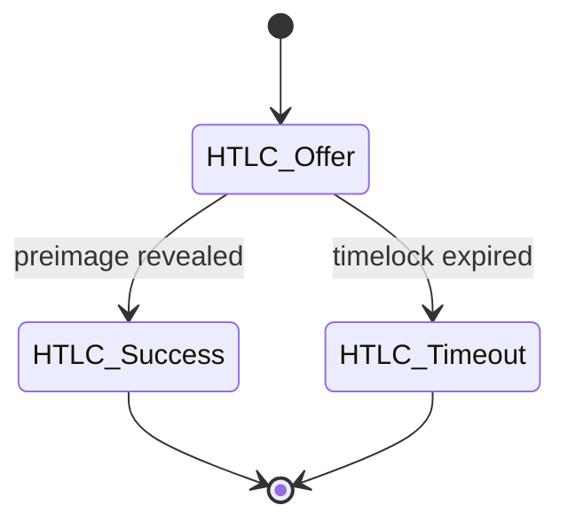
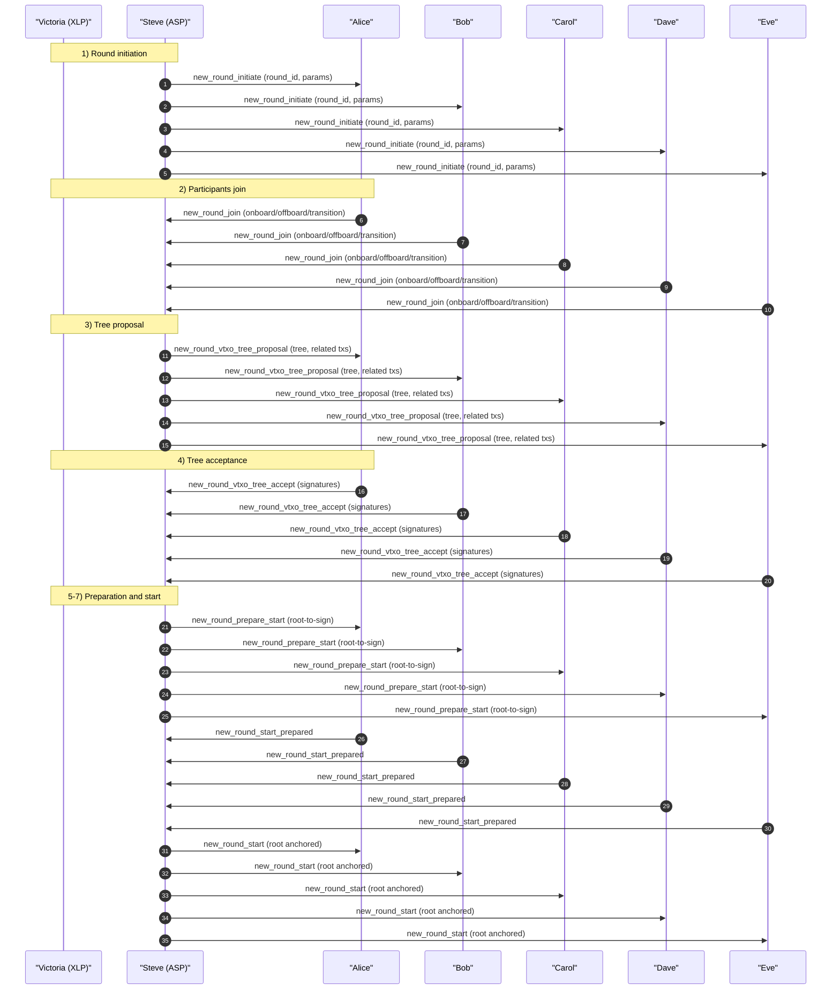

# OpenARK

## Status of this Document

This document specifies **BOLT-ARK**, a proposed extension to the Lightning Network protocol suite. It is an experimental specification intended for research, interoperability testing, and discussion. It does not modify existing BOLT consensus rules and introduces no new Bitcoin consensus changes.

The keywords **MUST**, **MUST NOT**, **SHOULD**, **SHOULD NOT**, and **MAY** are to be interpreted as described in RFC 2119.

---

## Abstract

OpenARK defines an extension to Lightning enabling **VTXO-based multi-party channels** with a designated **Ark Service Provider (ASP)** acting as a resolver and cosigner. The construction preserves HTLC semantics, supports RGB assets, and uses **Nostr** as the transport layer for off-chain coordination messages. The protocol allows many users to share a single on-chain root while retaining unilateral exit guarantees.

---

## Table of Contents

1. Introduction  
2. Goals and Non-Goals  
3. Terminology  
4. System Model  
5. Cryptographic Primitives  
6. VTXO Model  
7. Round Lifecycle  
8. HTLC Semantics in ARK  
9. Message Transport (Nostr)  
10. Funding, Forfeit, and Recycle Transactions  
11. On-chain Enforcement and Unilateral Exit  
12. RGB Integration  
13. Privacy Considerations  
14. Security Considerations  
15. Failure Modes and Recovery  
16. Compatibility with Lightning (BOLT 2–11)  
17. Deployment Considerations  
18. Acknowledgements  

---

## 1. Introduction

ARK extends Lightning by allowing multiple participants to share a **single on-chain funding root**, from which a **VTXO tree** is derived. State transitions are cosigned by an Ark Service Provider while preserving unilateral exit guarantees for users.

---

## 2. Goals and Non-Goals

### Goals
- Preserve HTLC compatibility with Lightning  
- Enable many-user shared liquidity via VTXO trees  
- Support RGB asset state transitions  
- Use Nostr as a censorship-resistant transport  
- Maintain unilateral exit at all times  

### Non-Goals
- Removing Bitcoin enforcement  
- Custodial fund control by the ASP  

---

## 3. Terminology

- **ASP (Ark Service Provider)**: Entity coordinating rounds and cosigning transitions  
- **User**: Participant owning a VTXO leaf  
- **Co-Verifier**: Optional third party holding one of the ASP threshold keys  
- **VTXO**: Virtual Transaction Output, representing off-chain ownership  
- **Round**: A bounded time window in which VTXO transitions occur  
- **Root Transaction**: On-chain transaction anchoring a round  

---

## 4. System Model

The system consists of:
- Bitcoin L1 for final settlement  
- Lightning-compatible HTLC semantics  
- A Nostr relay network for coordination  
- An ASP providing availability but not custody  

Trust assumptions:
- The ASP MAY censor but cannot steal funds  
- Users MUST be able to exit unilaterally  

---

## 5. Cryptographic Primitives

- Schnorr signatures (BIP-340)  
- MuSig2 for aggregate signing  
- Hashlocks and timelocks (BOLT-compatible)  
- Threshold signatures for ASP + Co-Verifiers  

---

## 6. VTXO Model

A VTXO is a logical output representing a claim to value under a spending condition that can be unilaterally committed on-chain by broadcasting a series of presigned transactions:

- Terminated by an output that is the last step in the spending path, called the **vtxo-leaf**.  
- Bound via a set of presigned transactions, called **vtxo-branches**, that connect off-chain state to an on-chain transaction called the **vtxo-root**.  
- Redeemable on-chain by broadcasting the transactions; this is called **unilateral exit**.  

Together, all VTXOs form a directed acyclic graph (the **vtxo-tree**).

---

## 7. Round Lifecycle

Each ARK round progresses through a well-defined set of states. Rounds are **time-bounded by Bitcoin block height** and advance deterministically based on protocol messages and on-chain conditions.

### 7.1 Round States

#### Initiated
The ASP announces a new round and accepts participant registrations.

#### Started
The VTXO tree has been finalized, the round vtxo-root is anchored on-chain, and off-chain transitions may occur.

#### Closed
The closing block has been reached. No new off-chain state transitions are permitted.

#### Recycled
The round is terminated and remaining value is recovered via the recycle transaction.

---

## 8. HTLC Semantics in ARK

ARK preserves Lightning HTLC semantics.

HTLCs MAY be resolved:
- Off-chain via ASP cosignature  
- On-chain via unilateral exit  

### HTLC State Machine

#### HTLC_Offer
Locks a VTXO under hashlock and timelock conditions and is signed by the sender and ASP.

#### HTLC_Success
Transfers the VTXO to the receiver upon presentation of the valid preimage. Signed by receiver, preimage, and ASP.

#### HTLC_Timeout
Returns the VTXO to the sender after timeout expiry. Signed by sender and ASP, optionally by the receiver.

---

## 9. Message Transport (Nostr)

ARK messages are transported over Nostr events.

Requirements:
- Messages MUST be signed by the sender  
- Events MUST reference the round ID  
- Relays MUST be treated as untrusted  

Detailed encoding is deferred to a companion **NIP-150** specification.

---

## 10. Funding, Forfeit, and Recycle Transactions

### Funding
Users MAY fund rounds by:
- Transferring value from a previous round  
- Adding new on-chain inputs  

### Forfeit Transactions
Forfeit transactions atomically bind ownership transfer from a closed-round VTXO to a new-round vtxo-root.

### Recycle Transactions
Recycle transactions recover value for offline or inactive participants and guarantee round termination.

---

## 11. On-chain Enforcement and Unilateral Exit

At any time, a user MAY:
- Broadcast a unilateral exit transaction  
- Claim VTXO value on-chain by converting it to a UTXO  

All VTXOs MUST map to a valid on-chain spending path.

---

## 12. RGB Integration

ARK supports RGB by associating asset state transitions with VTXO transitions.

Requirements:
- RGB state MUST follow Bitcoin ownership  
- Asset and BTC transitions MUST be atomic  

---

## 13. Privacy Considerations

- VTXO ownership is off-chain  
- The ASP learns graph structure but not intent  
- Nostr metadata leakage MUST be considered  

---

## 14. Security Considerations

Threats:
- ASP censorship  
- Relay censorship  
- Key compromise  

Mitigations:
- Unilateral exits  
- Time-bounded rounds  
- Threshold signing  

---

## 15. Failure Modes and Recovery

- Offline users are handled via recycle paths  
- ASP failure triggers unilateral exits  
- Co-Verifiers reduce single-operator risk  

---

## 16. Compatibility with Lightning (BOLT 2–11)

ARK:
- Preserves HTLC behavior  
- Does not alter gossip or routing  
- Operates as an L2/L3 construction  

Existing Lightning nodes are not required to understand ARK internals.

---

## 17. Deployment Considerations

- ASPs SHOULD publish reliability metrics  
- Users SHOULD limit exposure per round  
- Multiple ASPs MAY coexist, interconnected via Lightning  

---

## 18. Acknowledgements

This design draws inspiration from Lightning, channel factories, and the ARK research lineage.

---

## Appendix A: Worked Examples

### Example 1.0 — Alice, Bob, Carol, Dave, and Eve create a VTXO tree

In this example, the users join a new ARK round run by the ASP (**Steve**). An optional external liquidity provider (**Victoria**, acting as an XLP) may also participate in the round.

1. Steve issues `new_round_initiate` to announce that a new round is starting.
2. Alice, Bob, Carol, Dave, Eve (and optionally Victoria) reply with `new_round_join`.
   - Participants declare what to onboard, what to offboard, and what to transition from the previous round.
3. Steve issues `new_round_vtxo_tree_proposal`.
   - The proposed VTXO tree (and any associated templates) is distributed for review and signing.
4. Participants issue `new_round_vtxo_tree_accept`.
   - Participants return signatures for the required nodes/transactions.
5. Steve issues `new_round_prepare_start`.
   - Steve distributes the round root to be signed, binding the accepted tree to the new root.
6. Participants issue `new_round_start_prepared`.
   - Participants attest they are prepared for the round start (e.g., final signatures are complete).
7. Steve issues `new_round_start`.
   - The vtxo-root is broadcast on-chain (anchoring the round) and the round transitions to **Started**.

#### Sequence diagram

