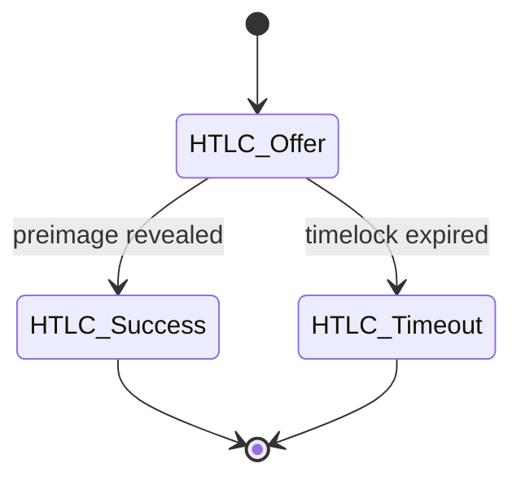
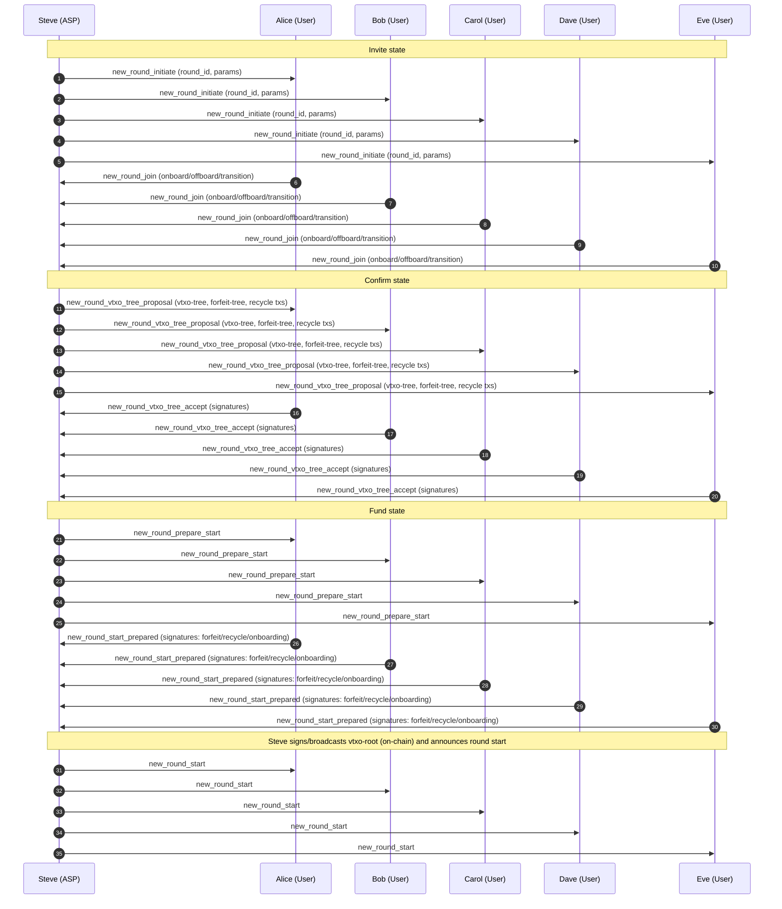
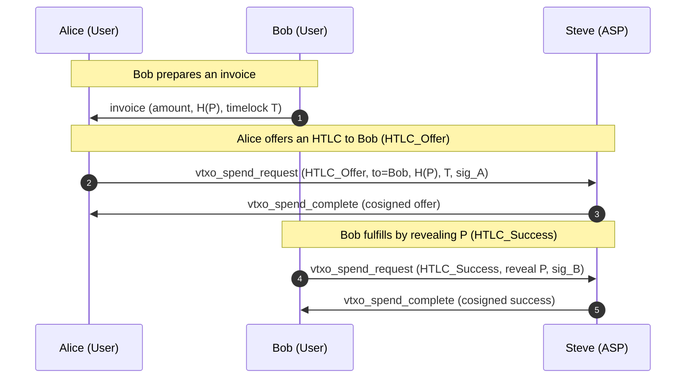
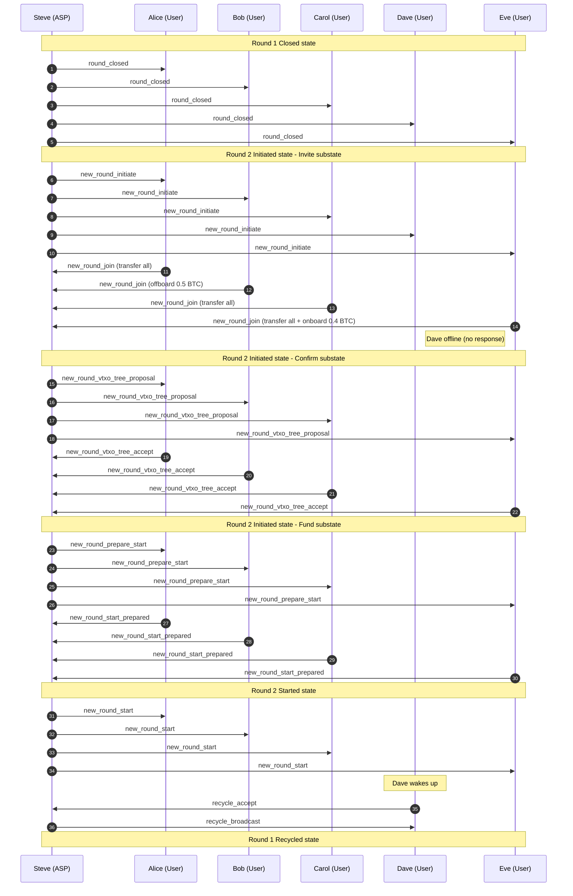

# OpenARK

## Status of this Document

This document specifies **BOLT-ARK**, a proposed extension to the Lightning Network protocol suite. It is an experimental specification intended for research, interoperability testing, and discussion. It does not modify existing BOLT consensus rules and introduces no new Bitcoin consensus changes.

The keywords **MUST**, **MUST NOT**, **SHOULD**, **SHOULD NOT**, and **MAY** are to be interpreted as described in RFC 2119.

---

## Abstract

OpenARK defines an extension to Lightning enabling **VTXO-based multi-party channels** with a designated **Ark Service Provider (ASP)** acting as a resolver and cosigner. The construction preserves HTLC semantics, supports RGB assets, and uses **Nostr** as the transport layer for off-chain coordination messages. The protocol allows many users to share a single on-chain root while retaining unilateral exit guarantees.

---

## Table of Contents

1. Introduction
2. Goals and Non-Goals
3. Terminology
4. System Model
5. Cryptographic Primitives
6. VTXO Model
7. Round Lifecycle
8. Message Transport (Nostr)
9. HTLC Semantics in ARK
10. Funding, Forfeit, and Recycle Transactions
11. On-chain Enforcement and Unilateral Exit
12. RGB Integration
13. Privacy Considerations
14. Security Considerations
15. Failure Modes and Recovery
16. Compatibility with Lightning (BOLT 2–11)
17. Deployment Considerations
18. Acknowledgements
19. Examples

---

## 1. Introduction

ARK extends Lightning by allowing multiple participants to share a **single on-chain funding root**, from which a **VTXO tree** is derived. State transitions are cosigned by an Ark Service Provider while preserving unilateral exit guarantees for users.

---

## 2. Goals and Non-Goals

### Goals
- Preserve HTLC compatibility with Lightning
- Enable many-user shared liquidity via VTXO trees
- Support RGB asset state transitions
- Use Nostr as a censorship-resistant transport
- Maintain unilateral exit at all times

### Non-Goals
- Removing Bitcoin enforcement
- Custodial fund control by the ASP

---

## 3. Terminology

- **ASP (Ark Service Provider)**: Entity coordinating rounds and cosigning transitions
- **User**: Participant owning a VTXO leaf
- **Co-Verifier**: Optional third party holding one of the ASP threshold keys
- **VTXO**: Virtual Transaction Output, representing off-chain ownership
- **Round**: A bounded time window in which VTXO transitions occur
- **Root Transaction**: On-chain transaction anchoring a round

---

## 4. System Model

The system consists of:
- Bitcoin L1 for final settlement
- Lightning-compatible HTLC semantics
- A Nostr relay network for coordination
- An ASP providing availability but not custody

Trust assumptions:
- ASP MAY censor but cannot steal funds
- Users MUST be able to exit unilaterally

---

## 5. Cryptographic Primitives

- Schnorr signatures (BIP-340)
- MuSig2 for aggregate signing
- Hashlocks and timelocks (BOLT-compatible)
- Threshold signatures for ASP + Co-Verifiers

---

## 6. VTXO Model

A VTXO is a logical output representing claim to value under a spending condition, that can be unilaterally committed on-chain by transmitting a series of presigned transactions that are:

- Terminated by an output that is the last step in the spending path and is called the vtxo-leaf.
- Bound via a set of presigned transactions, called vtxo-branches that are kept off-chain to an on-chain transaction called the vtxo-root.
- Redeemable on-chain by broadcasting the transactions, this is called unilateral exit.

Together all the VTXOs form a directed acyclic graph (the vtxo-tree).

---

## 7. Round Lifecycle

Each ARK round progresses through a well-defined set of states. Rounds are **time-bounded by Bitcoin block height** and advance deterministically based on protocol messages and on-chain conditions.

### 7.1 Round States

The lifecycle consists of the following states:

- **Initiated**
  The ASP announces a new round and accepts participant registrations.

- **Started**  
  The VTXO tree has been finalized, the round vtxo-root is anchored on-chain, and off-chain transitions may occur.

- **Closed**  
  The closing block has been reached. No new off-chain state transitions are permitted. Participants may prepare for exit or transfer funds to a new round.

- **Recycled**  
  The round is terminated. Remaining value is recovered via the recycle transaction, allowing inactive or offline participants to reclaim funds.

#### 7.1.1 Initiated state

This state has in turn three sub-states: invite, confirm, and fund.

##### Invite state
The goal of this substate is to invite users to join the round.

This substate starts with the ASP announces a new round using the `new_round_initiate` message, inviting users to join.

They do so by responding with a `new_round_join` message, containing:
- funds to onboard
- funds to offboard

The default is that all funds in the previous round are onboarded. If several users need to agree to on-board funds, perhaps because of  
a shared vtxo, then all users MUST agree to onboard for the vtxo to be included. 

The ASP then waits for either the min_timeout is reached and all users that are tagged have responded, or if the max_timeout is reached. 
Once this happens, the initialization is moved to the confirm substate. 

##### Confirm state
The goal of this substate is to finalize the vtxo-tree including the users signatures. 

This state starts with the ASP broadcasting the `new_round_vtxo_tree_proposal` message, containing:
- the new vtxo-tree
- forfeit tree
- unilateral recycle transaction
- cooperative recycle transaction

Users verify these transactions and return their signatures on the new vtxo-tree using the `new_round_vtxo_tree_accept` message.
Once all users have signed the new vtxo-tree, the initialization moves to the fund substate.

##### Fund state
The goal of this substate is to fund the round.

This state starts with the ASP broadcasting the `new_round_prepare_start` message. 

After which users respond with a `new_round_start_prepared` where they sign:
- the forfeit transactions
- the cooperative recycling transaction
- any onboarding transactions. 

When all of these are signed, the ASP will sign the vtxo-root and broadcast it, ending the initialization.

##### Aborting the initialization

A user can at any time and for any reason abort the onboarding and instead chose to have his capital recycled by issuing
a `new_round_abort` message. In this case, the initialization is aborted for that user, and their funds MUST be handled via the recycle path (or carried forward into the next round, if applicable).

#### 7.1.2 Started state
This state is entered when the VTXO tree has been finalized and the round vtxo-root is anchored on-chain and the ASP broadcasts the `new_round_start` message.

Here users can send and receive off-chain HTLCs.

#### 7.1.3 Closed state
This state is entered when the closing block has been found and the ASP broadcasts the `round_closed` message.

When the closing block is found, the ASP MUST immediately send a `vtxo_spend_aborted` on all outstanding `vtxo_spend_request` messages, then broadcasts the `round_closed` message, initiating the state.
Unless this round is the final round for the ASP and the service is terminating, a new round should be initiated using the procedure described in Section 7.1.1.

#### 7.1.4 Recycled state
This state is entered when the recycling transaction has been broadcast by the ASP.

Users that have not yet signed the recycle transaction can do this by broadcasting the `recycle_accept` message. Once all users have signed the recycle transaction, the ASP will broadcast the `recycle_broadcast` message, initiating the state.
This can either happen when all users, as well as the ASP have signed and broadcast the recycle transaction (collaborative recycling) or when the recycling block has been found unilaterally (unilateral recycling).

### 7.2 Block Height Bounds

Two block-height parameters define round progression:

- **Closing Block**  
  The Bitcoin block height at which the round MUST transition from *Started* to *Closed*. After this point, no new off-chain transitions are allowed.

- **Recycle Block**  
  The Bitcoin block height at which the ASP MAY unilaterally sign and broadcast the recycle transaction, transitioning the round to *Recycled*.

These bounds guarantee liveness while preserving unilateral exit guarantees for all users.

### 7.3 HTLC Transitions

Like Lightning, OpenARK supports HTLC transactions to make OpenARK compatible with existing Lightning Network. Unlike Lightning, the procedure is much simpler to implement.
In OpenARK we only need a few simple transactions to create a HTLC state machine. These are based around the following pattern,

1. A user initiates a `vtxo_spend_request` message, including:
   1. tagging the template in use.
   2. parameters required by the model.
   3. tagging any other users that need to co-sign the request.
   4. signature
2. Other users that are tagged in the request will issue a `vtxo_spend_accept` message, providing their signature.
3. Once all users have signed the request, the ASP will issue a `vtxo_spend_complete` message, providing the complete transaction.

#### Aborting a Request

A `vtxo_spend_request` can be aborted in four ways:

1. If a tagged user does not like the request, he can issue a `vtxo_spend_reject` message, optionally providing a reason for the rejection. 
2. The user that initated the request can issue a `vtxo_spend_abort_request`.
3. The closing block is reached.
4. the ASP does not like the request for any reason.

In either case the ASP will issue a `vtxo_spend_failed` message, making the vtxo free again.

## 8. HTLC Semantics in ARK

ARK preserves Lightning HTLC semantics:

HTLCs MAY be resolved:
- Off-chain via ASP cosignature
- On-chain via unilateral exit

#### HTLC States

##### HTLC_Offer

This state locks one of the vtxos with a lock base around `B + H(P) + ( dT1 | S ) | A + ( T | B ) + ( dt2 | S )` where:

1. A is the sending key.
2. B is the receiving key.
3. H(P) is the preimage hash.
4. S is the ASP.
5. T is the HTLC timelock.
6. dt1 is the success ark-timeout.
7. dt2 is the timeout ark-timeout.

It is signed by A, S.

##### HTLC_Success

This state transfers a HTLC vtxo into a simple `B+S | B + dT` where:

1. B is the receiving key.
2. dT is the ark-timelock.

It is signed by B, P, S.
Here S verifies that B has signed the transaction and that the preimage matches H(P).

##### HTLC_Timeout

This state transfers a HTLC vtxo into a simple `A+S | A + dT` where:

1. A is the sending key.
2. dT is the ark-timelock.

It is signed by A, S, and optionally B.
Here S verifies that eith B has signed the transaction, or T has passed.

## 9. Message Transport (Nostr)

ARK messages are transported over Nostr events.

Requirements:
- Messages MUST be signed by the sender
- Events MUST reference the round ID
- Relays MUST be treated as untrusted

This document defers detailed encoding to a companion **NIP-150** specification.

---

## Two-tier security – Cloud Agents

OpenARK requires the user to run some form of always-on agent to represent him in the ARK. This does not diverge from traditional 
lightning setups, where the user in practice is required to run an always-on guard tower, that prevents the counterparty from 
broadcasting an old state. Now in ARK the responsibility is extended beyond just guarding for fraudulent unilateral exits to also
include managing the round transition. The protocol is therefore designed with this in mind. When we describe the transactions above 
we usually refer to a single large letter, say A to represent the user. Now in practice this is a shortcut. The large A represent a 
valid signature from the user A. But in practice it is more complicated. When a user first joins the ARK, he will present two Nostr ids,
one primary id, used by the owner, and one secondary id used by the agent. He will also present two distinct key series, one used by the owner, A',
and one used by the agent, A''. The letter A is then represented by a combination of signatures. A' | A'' in the vtxo-tree root, trunk, and branches,
and A' | A'' + T for the leaves, where T is the closing block of the round.

From this setup the user can tailor his setup to meet his security needs. Some users may prefer to run an always-on cloud wallet that combines the 
responsibilities of a guard tower and the wallet, renting a spot in the datacenter for their own hardware, possibly with an HSM module.

Other users may outsource the agent role and limit it to simply guard against fraudulent unilateral exits and help with the round transition.
In this case it might make sense to limit the agents' access to only include the A'' series of keys and do a rekey at the start of each round.

## 10. Funding, Forfeit, and Recycle Transactions

### Funding
Users MAY fund rounds by:
- Transferring value from a previous round
- Adding new on-chain inputs

### Forfeit Transactions
Forfeit transactions atomically bind the transfer of ownership from the User to the ASP in a closed-round vtxo to a new-round vtxo-root. Making the root deposit an atomic transaction, enacting the forfeiture.   

### Recycle Transactions
Recycle transactions recover value to offline or inactive participants, enabling early termination of a round.

---

## 11. On-chain Enforcement and Unilateral Exit

At any time, a user MAY:
- Broadcast a unilateral exit transaction
- Claim their VTXO value on-chain by converting the VTXO to a UTXO.

All VTXOs MUST map to a valid on-chain spending path.

---

### External liquidity providers

In the case where the ASP does not have enough funds to cover the cost of the round, one or several external liquidity 
providers (XLPs) MAY be used to raise the required capital. In this case the XLP SHOULD join the ASP as a co-verifier. 
They serve a dual role, they provide trust by increasing the number of verifiers for the critical S key. They also provide
liquidity in the round. 

This is done by the ASP adding the XLPs on-chain inputs to the vtxo-root, but then in turn adding matching XLPs outputs 
to the forfeit as well as the recycle transactions. The procedure is transparent, and the XLP can verify that if the vtxo-root
is deposited, then he can regain his funds either through the forfeit transactions or preferably by recycle transaction, at
the latest when the recycle block is discovered. 

## 12. RGB Integration

ARK supports RGB by associating asset state transitions with VTXO transitions.

Requirements:
- RGB state MUST follow Bitcoin ownership
- Asset and BTC transitions MUST be atomic

Examples in Section 2 illustrate cross-asset HTLC swaps.

---

## 13. Privacy Considerations

- VTXO ownership is off-chain
- ASP learns graph structure but not intent
- Nostr metadata leakage MUST be considered

---

## 14. Security Considerations

Threats:
- ASP censorship
- Relay censorship
- Key compromise

Mitigations:
- Unilateral exits
- Time-bounded rounds
- Threshold signing

---

## 15. Failure Modes and Recovery

- Offline users are handled via recycle paths
- ASP failure triggers unilateral exits
- Co-Verifiers reduce single-operator risk

---

## 16. Compatibility with Lightning (BOLT 2–11)

ARK:
- Preserves HTLC behavior
- Does not alter gossip or routing
- Operates as an L2/L3 construction

Existing Lightning nodes are not required to understand ARK internals.

---

## 17. Deployment Considerations

- ASPs SHOULD publish reliability metrics
- Users SHOULD limit exposure per round
- Multiple ASPs MAY coexist interconnected via lightning.

---

## 18. Acknowledgements

This design draws inspiration from Lightning, channel factories, and the ARK research lineage.

## 19. Examples

### Roles

- **Users**: Alice, Bob, Carol, Dave, Eve.
- **Ark Service Provider (ASP)**: Steve.
- **External Liquidity Provider (XLP)**: Victoria.

### Example 1.0 – Alice, Bob, Carol, Dave, and Eve create a VTXO tree

In this part of the example, the users join a new ARK round run by Steve.

1. Steve issues a `new_round_initiate`
    1. Informs everybody that a new round is starting.
2. Alice, Bob, Carol, Dave and Eve reply with `new_round_join`
    1. Here the Users declare what to onboard, what to offboard and what to transition.
3. Steve issues a `new_round_vtxo_tree_proposal`
    1. Here Steve sends out the VTXO tree for signing.
4. Alice, Bob, Carol, Dave and Eve issue a `new_round_vtxo_tree_accept`
    1. Here the Users return the signed nodes.
5. Steve issues a `new_round_prepare_start`
    1. Here Steve sends out the new root for signature, binding the tree to the root.
6. Alice, Bob, Carol, Dave and Eve issue a `new_round_start_prepared`.
    1. Here all Users accept the tree.
7. Steve issues a `new_round_start`.
    1. The root is deposited and the round starts. This is the official start of the round.

### Example 1.1 – Alice pays Bob

This example uses the `vtxo_spend_*` flow described in Section 7.3 and the HTLC states described in Section 8.

1. **Invoice creation**
   1. Bob samples a secret preimage **P** and computes **H(P)**.
   2. Bob sends Alice an invoice containing the amount, **H(P)**, and timelock **T**.

2. **Offer (HTLC_Offer)**
   1. Alice constructs a `vtxo_spend_request`, tagged as `HTLC_Offer`, that locks funds under hashlock **H(P)** and timelock **T**.
   2. Steve verifies required signatures and issues `vtxo_spend_complete`, finalizing the offer state.

3. **Fulfill (HTLC_Success)**
   1. Bob reveals **P** by constructing a `vtxo_spend_request`, tagged as `HTLC_Success`.
   2. Steve verifies `H(P)`, signatures and issues `vtxo_spend_complete`, finalizing the success state.

If Bob does not fulfill before **T**, Alice MAY instead progress to `HTLC_Timeout` using an analogous `vtxo_spend_request` flow.

### Example 1.2 – Round ends, Bob offboards 0.5 BTC, Dave is offline, Eve onboards 0.4 BTC

This example illustrates round closure, offboarding, onboarding, and recycling behavior when a participant is offline.

1. The Bitcoin block designated as the **closing block** is mined.
2. Steve broadcasts `round_closed`, marking the end of off-chain activity for the round.
3. Steve initiates a new round with `new_round_initiate`.
4. Participants respond with `new_round_join`:
   1. Alice transfers all capital forward.
   2. Bob offboards **0.5 BTC**.
   3. Carol transfers all capital forward.
   4. Dave is offline and does not respond.
   5. Eve transfers all existing capital and onboards **0.4 BTC**.
5. After the timeout, Steve issues `new_round_vtxo_tree_proposal`, including:
   1. A new round transaction containing:
       1. A new VTXO root output, locked with A+B+C+E+S | S + T=400.
       2. An offboarding output for Bob
       3. A forfeit root output.
       4. A funding input for Eve.
       5. A funding input for Steve.
   2. Forfeit control transaction.
   3. Forfeit transactions for the capital that is being transferred.
   4. A recycle transaction for the round containing:
       1. An output with Dave's capital based on his recycle address.
       2. An output to Steve with the rest of the capital.
6. Alice, Bob, Carol, and Eve verify the proposal and respond with `new_round_vtxo_tree_accept`.
7. Steve requests final signatures via `new_round_prepare_start`.
8. Alice, Bob, Carol, and Eve respond with `new_round_start_prepared`.
9. Steve broadcasts the new round root and issues `new_round_start`.
10. When Dave later comes online, he issues `recycle_accept`.
11. Steve broadcasts the recycle transaction, allowing Dave to recover his funds.

///////

1. The block designated as the closing block at the start of the round is mined.
2. Steve issues a **new_round_initiate** message signaling a new round.
3. Steve issues **round_closed**. He tags the **new_round_initiate** message indicating the round to be transferred to.
4. The Users decide how to proceed with the new round, and they each issue a **new_round_join** message.
    1. Alice indicates that she wants to transfer all of her capital.
    2. Bob indicates that he wants to offboard 0.5 BTC.
    3. Carol indicates that she wants to transfer all of her capital.
    4. Dave is offline and does not send a message, hence missing the round. His capital is left in the closed round and will be recycled.
    5. Eve indicates that she wants to transfer all her current capital and also to onboard 0.4 BTC.
5. Steve collects the responses and, after the timeout is reached, issues a **new_round_vtxo_tree_proposal**. This includes:
    1. A new round transaction containing:
        1. A new VTXO root output, locked with A+B+C+E+S | S + T=400.
        2. An offboarding output for Bob
        3. A forfeit root output.
        4. A funding input for Eve.
        5. A funding input for Steve.
    2. Forfeit control transaction.
    3. Forfeit transactions for the capital that is being transferred.
    4. A recycle transaction for the round containing:
        1. An output with Dave's capital based on his recycle address.
        2. An output to Steve with the rest of the capital.
6. The Users, Alice, Bob, Carol and Eve verify that the tree matches the request, and then each issues a **new_round_vtxo_tree_accept**. It contains:
    1. Signatures for the new VTXO tree.
7. Steve verifies that everything is there and then issues a **new_round_funding_request**.
8. The Users, Alice, Bob, Carol and Eve verify that everything is OK, and then each issues a **new_round_funding_accept**. It contains:
    1. Signatures for the forfeit transactions.
    2. Signatures for the funding transactions (only Eve has one).
    3. Signatures for the recycle transaction.
9. Steve verifies that the funding has been received, commits the transaction, and then issues a **new_round_start**.
10. Dave comes online, understands that he missed the round, and issues a **recycle_accept** containing his signature for the recycle transaction.
11. Steve submits the recycle transaction.

